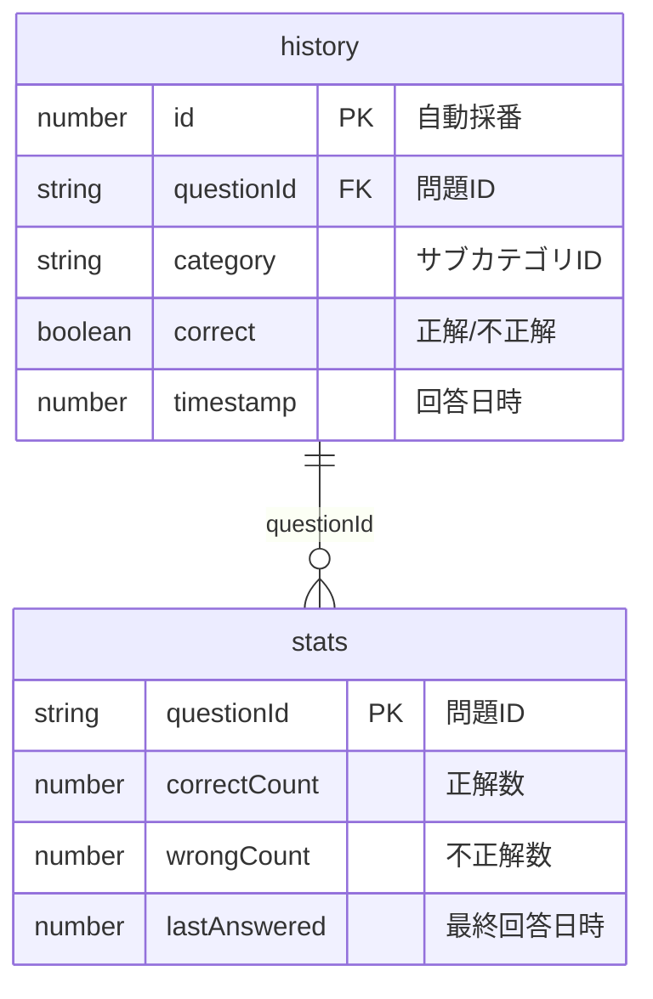
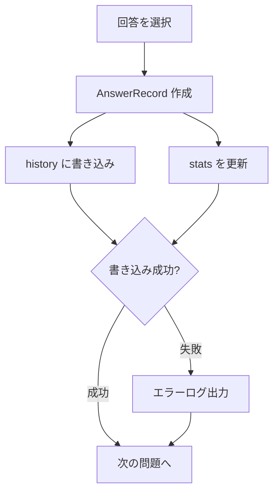

# Word Drill - データ永続化仕様（IndexedDB）

> **機能**: [Word Drill](./index.md)
> **ステータス**: 計画中

## 概要

学習の回答履歴と問題別統計をIndexedDBでローカルに永続化する。
サーバーサイドを持たないSPAアーキテクチャのため、すべてのデータはブラウザのIndexedDBに保存される。

## データベース定義

| 項目 | 値 |
|:-----|:---|
| データベース名 | `word-drill` |
| バージョン | `1` |

## Object Store 一覧

| ストア名 | 説明 |
|:---------|:-----|
| `history` | 回答履歴（1回答1レコード） |
| `stats` | 問題別の集計統計 |

## スキーマ

### history（回答履歴）

| フィールド | 型 | NULL許可 | デフォルト | 説明 |
|:----------|:---|:---------|:----------|:-----|
| id | number | NO | 自動採番 | 主キー（autoIncrement） |
| questionId | string | NO | - | 問題ID（例: `prog-rust-001`） |
| category | string | NO | - | サブカテゴリID（例: `prog-rust`） |
| correct | boolean | NO | - | 正解したか |
| timestamp | number | NO | - | 回答日時（Unix ミリ秒） |

### stats（問題別統計）

| フィールド | 型 | NULL許可 | デフォルト | 説明 |
|:----------|:---|:---------|:----------|:-----|
| questionId | string | NO | - | 問題ID（主キー） |
| correctCount | number | NO | `0` | 正解数 |
| wrongCount | number | NO | `0` | 不正解数 |
| lastAnswered | number | NO | - | 最終回答日時（Unix ミリ秒） |

## インデックス

### history のインデックス

| インデックス名 | 対象フィールド | ユニーク | 用途 |
|:-------------|:-------------|:---------|:-----|
| `questionId` | questionId | NO | 問題別の回答履歴検索 |
| `category` | category | NO | カテゴリ別の集計 |
| `timestamp` | timestamp | NO | 日付範囲フィルタ・連続学習日数計算 |

### stats のインデックス

| インデックス名 | 対象フィールド | ユニーク | 用途 |
|:-------------|:-------------|:---------|:-----|
| (主キー) | questionId | YES | 問題IDでの直接アクセス |

## リレーションシップ



**注意**: IndexedDB にはRDBのような外部キー制約はない。`history.questionId` と `stats.questionId` の整合性はアプリケーション層で保証する。

## データライフサイクル

### history

| イベント | トリガー | 動作 | 備考 |
|:--------|:--------|:-----|:-----|
| 作成 | クイズで1問回答するたび | `{ questionId, category, correct, timestamp: Date.now() }` をput | 1回答1レコード |
| 読取 | 統計画面の表示 | category や timestamp でフィルタして集計 | |
| 削除 | 履歴リセット | ストア内の全レコードを削除 | 確認ダイアログ必須 |

### stats

| イベント | トリガー | 動作 | 備考 |
|:--------|:--------|:-----|:-----|
| 作成/更新 | クイズで1問回答するたび | questionId で get → correctCount/wrongCount をインクリメント → put | 存在しなければ新規作成 |
| 読取 | 統計画面の苦手単語一覧 | 正答率50%以下をフィルタ | |
| 削除 | 履歴リセット | ストア内の全レコードを削除 | history と同時に削除 |

## データ書き込みフロー



**エラーハンドリング方針**: IndexedDB への書き込みが失敗してもクイズの進行は止めない。エラーはコンソールに出力し、統計データの欠損を許容する。

## 主要クエリパターン

### 全体統計の取得

```typescript
// 総回答数
const totalCount = await history.count()

// 正答率
const allRecords = await history.getAll()
const correctCount = allRecords.filter(r => r.correct).length
const accuracyRate = Math.round((correctCount / totalCount) * 100)
```

### カテゴリ別正答率

```typescript
// category インデックスで検索
const categoryRecords = await history.index('category').getAll(categoryId)
const correctCount = categoryRecords.filter(r => r.correct).length
const accuracyRate = Math.round((correctCount / categoryRecords.length) * 100)
```

### 連続学習日数

```typescript
// timestamp インデックスで全レコード取得し、ユニーク日付を抽出
const allRecords = await history.index('timestamp').getAll()
const uniqueDates = new Set(allRecords.map(r => toDateString(r.timestamp)))
// 最新日付から逆算して連続日数をカウント
```

### 苦手な単語

```typescript
// stats ストアの全レコードを取得
const allStats = await stats.getAll()
const weakWords = allStats
  .filter(s => {
    const total = s.correctCount + s.wrongCount
    return total >= 2 && (s.correctCount / total) <= 0.5
  })
  .sort((a, b) => (a.correctCount / (a.correctCount + a.wrongCount))
                  - (b.correctCount / (b.correctCount + b.wrongCount)))
```

### 履歴リセット

```typescript
// トランザクション内で両ストアをクリア
const tx = db.transaction(['history', 'stats'], 'readwrite')
await tx.objectStore('history').clear()
await tx.objectStore('stats').clear()
await tx.done
```

## データ整合性

| ルール | 説明 | 強制方法 |
|:-------|:-----|:---------|
| history と stats の同期 | history に書き込むたびに stats も更新する | アプリケーション層（1トランザクション） |
| stats の正確性 | stats は history から再計算可能であること | リカバリ処理（計画中） |
| 履歴リセットの一貫性 | history と stats は同時に削除する | 1トランザクション内で両ストアをクリア |

## パフォーマンス考慮

| 観点 | 対策 |
|:-----|:-----|
| 想定レコード数 | history: 〜10,000件/月（1日30問×30日）。stats: 〜1,000件（全問題数相当） |
| 書き込み頻度 | 1回答ごとに2回（history + stats）。クイズ中はバッチ処理で最適化可能 |
| 読み込み頻度 | 統計画面表示時のみ。キャッシュ戦略は将来検討 |
| ストレージ容量 | 1レコード約100バイト。10,000件で約1MB。ブラウザのストレージ上限（通常50MB以上）の範囲内 |

## マイグレーション

| バージョン | 変更内容 | データ移行 |
|:----------|:---------|:----------|
| v1 → v2 | （未定） | IndexedDB の `onupgradeneeded` イベントで処理 |

IndexedDB のバージョン番号を上げ、`onupgradeneeded` コールバック内で既存データのマイグレーションを行う。

## 制限事項

- IndexedDB が利用できないブラウザ（プライベートブラウジングの一部）では統計機能が使えない
- 現在は未実装（スキーマ設計のみ）
- デバイス間のデータ同期は非対応
- ストレージがクリアされると全データを喪失（エクスポート機能は将来の拡張候補）
- history の大量レコード（100,000件以上）での集計パフォーマンスは未検証

## 関連仕様

- [stats-spec.md](./stats-spec.md) - 統計画面でのデータ表示方法
- [quiz-play-spec.md](./quiz-play-spec.md) - 回答データの生成元
- [quiz-data-spec.md](./quiz-data-spec.md) - questionId の命名規則と問題データ構造
