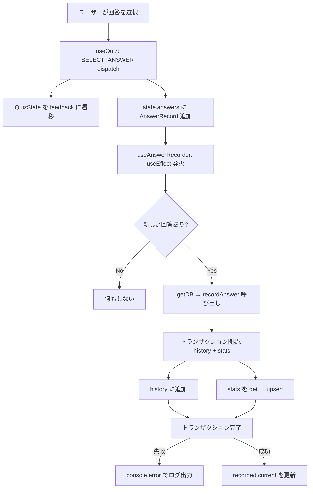
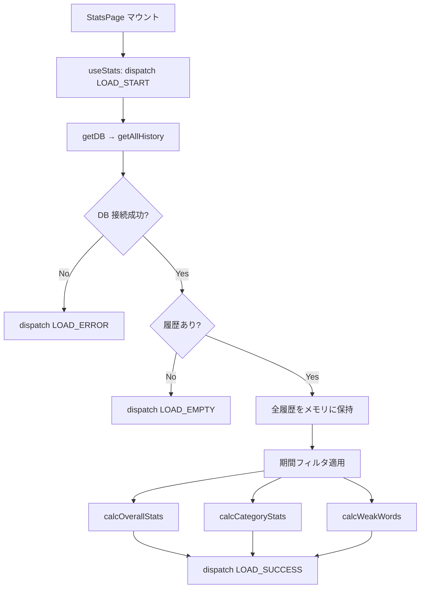
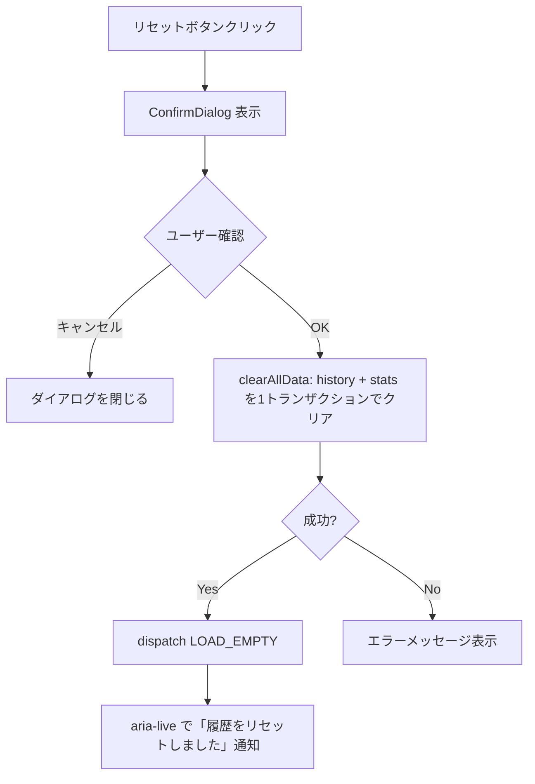

# 学習統計画面 + データ永続化 - 実装仕様書

> **バージョン**: 1.0

## 1. 設計コンテキスト

### 1.1 何を作るか

IndexedDB によるデータ永続化層（回答履歴の書き込み・読み取り）と、学習統計ダッシュボード画面を実装する。統計画面では全体統計（総回答数・正答率・連続学習日数）、カテゴリ別正答率（アコーディオン形式）、苦手な単語一覧（questionId 表示）を期間フィルタ付きで表示する。

### 1.2 なぜこう作るか

| 判断 | 採用した方針 | 理由（要約） |
|:-----|:-----------|:-----------|
| DB ライブラリ | `idb` を使用 | 軽量な Promise ラッパーで TypeScript 型安全。data-persistence-spec のコード例とも整合 |
| 書き込みタイミング | 1問回答ごとにリアルタイム書き込み | ブラウザ閉じ・クラッシュ時のデータ欠損を最小化 |
| 書き込みフックの分離 | `useAnswerRecorder` を別フックとして作成 | useQuiz は純粋なUI状態管理に徹する。関心の分離により既存テストに影響なし |
| 統計データソース | 常に history ストアから計算 | stats ストアは書き込み専用（将来の最適化用キャッシュ）。期間フィルタの有無に関わらず同じ計算ロジックで一貫性を保つ |
| 苦手単語の表示 | questionId のみ表示 | クイズデータファイル（JSON）が未作成のため、term の逆引きは将来対応 |
| カテゴリマッピング | categories.ts から逆引き | サブカテゴリID → メインカテゴリの対応を既存データから導出。未知のカテゴリは「その他」にまとめる |
| 状態管理 | useReducer によるカスタムフック（useStats） | loading/loaded/empty/error の状態遷移を明示的に管理 |
| 確認ダイアログ | カスタムモーダルコンポーネント | フォーカストラップ等の a11y 要件を満たすため。共通コンポーネントとして作成 |
| 連続学習日数 | 今日起点のみ（厳密モード） | 今日学習していなければ 0 日。シンプルで直感的 |
| タイムゾーン | ブラウザのローカルタイムゾーン | 日付計算（連続学習日数、期間フィルタの「今週」「今月」）はローカル時刻で行う |

### 1.3 やらないこと

- useQuiz のシグネチャ変更（DB 書き込みは別フック useAnswerRecorder で担当）
- 苦手単語の `term` 表示（クイズデータファイル未作成のため）
- stats ストアからの読み取り（統計画面の集計は常に history から計算）
- データのエクスポート・インポート機能
- デバイス間同期
- history の大量レコード（100,000件以上）でのパフォーマンス最適化
- Storybook の Story 作成

### 1.4 関連ドキュメント

- 設計仕様書: `docs/stats-spec.md`
- データ永続化仕様: `docs/data-persistence-spec.md`
- クイズプレイ仕様: `docs/quiz-play-spec.md`
- クイズデータ仕様: `docs/quiz-data-spec.md`

## 2. 技術コンテキスト

| 項目 | 値 |
|:-----|:---|
| 言語/バージョン | TypeScript ~5.9.3 |
| フレームワーク | React 19.2.0 |
| ルーター | @tanstack/react-router 1.147.x |
| ビルドツール | Vite (rolldown-vite 7.2.5) |
| データベース | IndexedDB（`idb` ライブラリ経由） |
| テストツール | Vitest 4.x + @testing-library/react 16.x + fake-indexeddb |
| パッケージマネージャー | pnpm |
| スタイリング | SCSS + BEM（CSS Modules 不使用） |
| ビルドコマンド | `pnpm build`（`tsc -b && vite build`） |
| テストコマンド | `pnpm test`（`vitest run`） |
| リントコマンド | `pnpm lint`（`eslint .`） |

## 3. 変更禁止事項

なし。必要に応じて既存コードも変更してよい。

## 4. ファイル構成

```
src/
├── components/
│   └── ConfirmDialog/
│       ├── index.ts              # [新規] re-export
│       ├── ConfirmDialog.tsx     # [新規] 確認ダイアログモーダル（フォーカストラップ付き）
│       ├── ConfirmDialog.scss    # [新規]
│       └── ConfirmDialog.test.tsx # [新規]
├── lib/
│   └── db/
│       ├── index.ts              # [新規] public API の re-export + recordAnswer
│       ├── database.ts           # [新規] DB 初期化・接続管理
│       ├── types.ts              # [新規] HistoryRecord, StatsRecord 型定義
│       ├── historyRepository.ts  # [新規] history ストアの CRUD 操作
│       ├── statsRepository.ts    # [新規] stats ストアの CRUD 操作
│       ├── database.test.ts      # [新規] DB 初期化テスト（fake-indexeddb）
│       ├── historyRepository.test.ts  # [新規] history 操作テスト（fake-indexeddb）
│       └── statsRepository.test.ts    # [新規] stats 操作テスト（fake-indexeddb）
├── features/
│   ├── quiz/
│   │   ├── hooks/
│   │   │   ├── useQuiz.ts            # [変更なし] 純粋なクイズ進行管理
│   │   │   ├── useAnswerRecorder.ts   # [新規] answers 変化を検知して DB 書き込み
│   │   │   └── useAnswerRecorder.test.ts # [新規]（fake-indexeddb）
│   │   └── components/
│   │       └── QuizScreen/
│   │           └── QuizScreen.tsx     # [変更] categoryId props 追加、useAnswerRecorder 呼び出し
│   └── stats/
│       ├── index.ts              # [新規] public API の re-export
│       ├── components/
│       │   ├── StatsPage/
│       │   │   ├── index.ts          # [新規]
│       │   │   ├── StatsPage.tsx     # [新規] 統計画面コンテナ
│       │   │   ├── StatsPage.scss    # [新規]
│       │   │   └── StatsPage.test.tsx # [新規]（fake-indexeddb）
│       │   ├── PeriodFilter/
│       │   │   ├── index.ts          # [新規]
│       │   │   ├── PeriodFilter.tsx  # [新規] 期間フィルタ ボタングループ
│       │   │   ├── PeriodFilter.scss # [新規]
│       │   │   └── PeriodFilter.test.tsx # [新規]
│       │   ├── OverallStats/
│       │   │   ├── index.ts          # [新規]
│       │   │   ├── OverallStats.tsx  # [新規] 全体統計カード
│       │   │   ├── OverallStats.scss # [新規]
│       │   │   └── OverallStats.test.tsx # [新規]
│       │   ├── CategoryStats/
│       │   │   ├── index.ts          # [新規]
│       │   │   ├── CategoryStats.tsx # [新規] カテゴリ別アコーディオン
│       │   │   ├── CategoryStats.scss # [新規]
│       │   │   └── CategoryStats.test.tsx # [新規]
│       │   ├── WeakWordsList/
│       │   │   ├── index.ts          # [新規]
│       │   │   ├── WeakWordsList.tsx  # [新規] 苦手な単語リスト
│       │   │   ├── WeakWordsList.scss # [新規]
│       │   │   └── WeakWordsList.test.tsx # [新規]
│       │   └── ResetButton/
│       │       ├── index.ts          # [新規]
│       │       ├── ResetButton.tsx   # [新規] 履歴リセットボタン（ConfirmDialog 使用）
│       │       ├── ResetButton.scss  # [新規]
│       │       └── ResetButton.test.tsx # [新規]
│       ├── hooks/
│       │   ├── useStats.ts           # [新規] 統計データの取得・集計フック（useReducer）
│       │   └── useStats.test.ts      # [新規]（fake-indexeddb）
│       └── utils/
│           ├── statsCalculator.ts     # [新規] 集計ロジック（純粋関数）
│           └── statsCalculator.test.ts # [新規]
└── app/
    └── routes/
        └── stats.tsx             # [変更] スタブ → StatsPage を描画
```

| ファイル | 操作 | 責務 |
|:---------|:-----|:-----|
| `src/components/ConfirmDialog/ConfirmDialog.tsx` | 新規 | 汎用確認ダイアログモーダル。フォーカストラップ、ESC で閉じる、aria 属性対応 |
| `src/lib/db/database.ts` | 新規 | IndexedDB の初期化・接続管理（シングルトン）。DB スキーマ定義 |
| `src/lib/db/types.ts` | 新規 | `HistoryRecord`, `StatsRecord` の型定義 |
| `src/lib/db/historyRepository.ts` | 新規 | history ストアへの追加・期間取得・全件取得・クリア |
| `src/lib/db/statsRepository.ts` | 新規 | stats ストアの get/upsert・クリア |
| `src/lib/db/index.ts` | 新規 | re-export + `recordAnswer`（history 追加 + stats 更新を1トランザクションで実行） |
| `src/features/quiz/hooks/useAnswerRecorder.ts` | 新規 | answers 配列の変化を useEffect + useRef で検知し、新しい回答を DB に書き込む |
| `src/features/quiz/components/QuizScreen/QuizScreen.tsx` | 変更 | `categoryId` props 追加。`useAnswerRecorder(categoryId, state.answers)` を呼び出す |
| `src/features/stats/components/StatsPage/StatsPage.tsx` | 新規 | 統計画面全体のコンテナ。useStats フックで状態管理。レスポンシブ3ブレークポイント対応 |
| `src/features/stats/components/PeriodFilter/PeriodFilter.tsx` | 新規 | 今週/今月/全期間の切り替えボタングループ |
| `src/features/stats/components/OverallStats/OverallStats.tsx` | 新規 | 総回答数・正答率・学習日数・連続学習日数のカード表示 |
| `src/features/stats/components/CategoryStats/CategoryStats.tsx` | 新規 | メインカテゴリ/サブカテゴリ別の正答率アコーディオン。ProgressBar 使用 |
| `src/features/stats/components/WeakWordsList/WeakWordsList.tsx` | 新規 | 苦手な単語（questionId）のリスト表示 |
| `src/features/stats/components/ResetButton/ResetButton.tsx` | 新規 | ConfirmDialog を使用した履歴リセットボタン。aria-live で完了通知 |
| `src/features/stats/hooks/useStats.ts` | 新規 | useReducer で loading/loaded/empty/error の状態管理。IndexedDB からデータ取得・集計 |
| `src/features/stats/utils/statsCalculator.ts` | 新規 | 純粋関数: 正答率計算・連続学習日数・カテゴリ別集計・苦手単語フィルタ |
| `src/app/routes/stats.tsx` | 変更 | StatsPage コンポーネントを描画するように更新 |

## 5. インターフェース定義

### 5.1 型定義

```typescript
// src/lib/db/types.ts

/** history ストアのレコード */
export type HistoryRecord = {
  id?: number             // autoIncrement（読み取り時は number）
  questionId: string      // 問題ID（例: "prog-rust-001"）
  category: string        // サブカテゴリID（例: "prog-rust"）
  correct: boolean        // 正解したか
  timestamp: number       // 回答日時（Unix ミリ秒）
}

/** stats ストアのレコード */
export type StatsRecord = {
  questionId: string      // 問題ID（主キー）
  correctCount: number    // 正解数
  wrongCount: number      // 不正解数
  lastAnswered: number    // 最終回答日時（Unix ミリ秒）
}
```

```typescript
// src/features/stats/utils/statsCalculator.ts で使用する型

/** 期間フィルタの値 */
export type Period = 'this-week' | 'this-month' | 'all'

/** 全体統計 */
export type OverallStatsData = {
  totalAnswers: number       // 総回答数
  accuracyRate: number | null // 全体正答率（%）。回答0件なら null
  studyDays: number          // 学習日数
  streakDays: number         // 連続学習日数（常に全期間・今日起点で計算）
}

/** カテゴリ別統計の1サブカテゴリ分 */
export type SubCategoryStatsData = {
  id: string                 // サブカテゴリID
  name: string               // サブカテゴリ名
  totalAnswers: number       // 総回答数
  accuracyRate: number | null // 正答率（%）
}

/** カテゴリ別統計の1メインカテゴリ分 */
export type MainCategoryStatsData = {
  id: string                 // メインカテゴリID
  name: string               // メインカテゴリ名
  totalAnswers: number       // 総回答数（配下の合計）
  accuracyRate: number | null // 正答率（%、配下の全回答から計算）
  subCategories: SubCategoryStatsData[]
}

/** 苦手な単語 */
export type WeakWordData = {
  questionId: string         // 問題ID
  correctCount: number       // 正解数
  totalCount: number         // 総回答数
  accuracyRate: number       // 正答率（%）
}

/** useStats の返り値の状態 */
export type StatsState =
  | { status: 'loading' }
  | { status: 'empty' }
  | { status: 'error'; message: string }
  | {
      status: 'loaded'
      overall: OverallStatsData
      categories: MainCategoryStatsData[]
      weakWords: WeakWordData[]
    }
```

```typescript
// src/components/ConfirmDialog/ConfirmDialog.tsx

export type ConfirmDialogProps = {
  open: boolean              // ダイアログの表示/非表示
  title: string              // ダイアログタイトル
  message: string            // 確認メッセージ
  confirmLabel?: string      // 確定ボタンラベル（デフォルト: "OK"）
  cancelLabel?: string       // キャンセルボタンラベル（デフォルト: "キャンセル"）
  onConfirm: () => void      // 確定時コールバック
  onCancel: () => void       // キャンセル時コールバック
}
```

### 5.2 関数シグネチャ

```typescript
// src/lib/db/database.ts
import type { IDBPDatabase } from 'idb'

export type WordDrillDB = IDBPDatabase<WordDrillDBSchema>

/**
 * IndexedDB 接続を取得する（シングルトン）
 */
export function getDB(): Promise<WordDrillDB>
```

```typescript
// src/lib/db/historyRepository.ts

/**
 * 回答履歴を1件追加する
 */
export function addHistory(db: WordDrillDB, record: Omit<HistoryRecord, 'id'>): Promise<number>

/**
 * 全回答履歴を取得する
 */
export function getAllHistory(db: WordDrillDB): Promise<HistoryRecord[]>

/**
 * 全回答履歴を削除する
 */
export function clearHistory(db: WordDrillDB): Promise<void>
```

```typescript
// src/lib/db/statsRepository.ts

/**
 * 回答結果を反映して問題別統計を更新する（なければ新規作成）
 */
export function upsertStats(db: WordDrillDB, questionId: string, correct: boolean): Promise<void>

/**
 * 全問題別統計を削除する
 */
export function clearStats(db: WordDrillDB): Promise<void>
```

```typescript
// src/lib/db/index.ts

/**
 * 1問の回答を IndexedDB に記録する
 * history への追加と stats の更新を1トランザクション内で行う
 */
export function recordAnswer(
  db: WordDrillDB,
  params: { questionId: string; category: string; correct: boolean }
): Promise<void>

/**
 * history と stats を1トランザクションで全件削除する
 */
export function clearAllData(db: WordDrillDB): Promise<void>
```

```typescript
// src/features/quiz/hooks/useAnswerRecorder.ts

/**
 * answers 配列の変化を監視し、新しい回答を IndexedDB に書き込む
 * useQuiz と併用する。useQuiz は変更しない。
 */
export function useAnswerRecorder(
  categoryId: string,
  answers: AnswerRecord[]
): void
```

```typescript
// src/features/stats/utils/statsCalculator.ts

/**
 * 回答履歴から全体統計を計算する
 * @param records - 期間でフィルタ済みの回答履歴
 * @param allRecords - 全期間の回答履歴（連続学習日数の計算用）
 */
export function calcOverallStats(records: HistoryRecord[], allRecords: HistoryRecord[]): OverallStatsData

/**
 * 回答履歴からカテゴリ別統計を計算する
 * 未知のカテゴリID は「その他」メインカテゴリにまとめる
 */
export function calcCategoryStats(records: HistoryRecord[]): MainCategoryStatsData[]

/**
 * 回答履歴から苦手な単語を抽出する
 * 条件: 正答率50%以下 かつ 回答回数2回以上。正答率の低い順にソート
 */
export function calcWeakWords(records: HistoryRecord[]): WeakWordData[]

/**
 * 期間フィルタの開始タイムスタンプを取得する（ローカルタイムゾーン）
 * - 'this-week': 今週月曜日 00:00:00
 * - 'this-month': 今月1日 00:00:00
 * - 'all': 0（全期間）
 */
export function getPeriodStart(period: Period): number

/**
 * 連続学習日数を計算する（全期間の history を使用）
 * 今日起点: 今日学習していなければ 0 日
 */
export function calcStreakDays(records: HistoryRecord[]): number
```

```typescript
// src/features/stats/hooks/useStats.ts

/**
 * 統計データの取得・集計を管理するフック（useReducer ベース）
 */
export function useStats(): {
  state: StatsState
  period: Period
  setPeriod: (period: Period) => void
  expandedCategories: Set<string>
  toggleCategory: (categoryId: string) => void
  resetHistory: () => Promise<void>
}
```

| 関数 | 引数 | 戻り値 | 副作用 | エラー |
|:-----|:-----|:-------|:-------|:-------|
| `getDB` | なし | `Promise<WordDrillDB>` | IndexedDB 接続作成 | DB 接続失敗時に reject |
| `addHistory` | `db, record` | `Promise<number>` | history ストアに追加 | トランザクション失敗時に reject |
| `recordAnswer` | `db, { questionId, category, correct }` | `Promise<void>` | history 追加 + stats 更新 | トランザクション失敗時に reject |
| `clearAllData` | `db` | `Promise<void>` | history + stats を全件削除 | トランザクション失敗時に reject |
| `useAnswerRecorder` | `categoryId, answers` | `void` | 新しい回答を DB に書き込み | エラーは console.error |
| `calcOverallStats` | `records, allRecords` | `OverallStatsData` | なし | なし |
| `calcCategoryStats` | `records` | `MainCategoryStatsData[]` | なし | なし |
| `calcWeakWords` | `records` | `WeakWordData[]` | なし | なし |
| `calcStreakDays` | `records` | `number` | なし | なし |

## 6. データ構造

### 6.1 IndexedDB スキーマ

#### history

| フィールド | 型 | 制約 | デフォルト | 説明 |
|:----------|:---|:-----|:----------|:-----|
| id | number | PK, autoIncrement | 自動採番 | 主キー |
| questionId | string | NOT NULL | - | 問題ID |
| category | string | NOT NULL | - | サブカテゴリID |
| correct | boolean | NOT NULL | - | 正解/不正解 |
| timestamp | number | NOT NULL | - | 回答日時（Unix ms） |

**インデックス**:

| インデックス名 | フィールド | ユニーク | 用途 |
|:-------------|:---------|:---------|:-----|
| `questionId` | questionId | NO | 問題別の回答履歴検索 |
| `category` | category | NO | カテゴリ別の集計 |
| `timestamp` | timestamp | NO | 期間フィルタ |

#### stats

| フィールド | 型 | 制約 | デフォルト | 説明 |
|:----------|:---|:-----|:----------|:-----|
| questionId | string | PK | - | 問題ID |
| correctCount | number | NOT NULL | 0 | 正解数 |
| wrongCount | number | NOT NULL | 0 | 不正解数 |
| lastAnswered | number | NOT NULL | - | 最終回答日時（Unix ms） |

### 6.2 idb スキーマ定義

```typescript
// src/lib/db/database.ts
import { openDB, type DBSchema, type IDBPDatabase } from 'idb'

interface WordDrillDBSchema extends DBSchema {
  history: {
    key: number
    value: {
      questionId: string
      category: string
      correct: boolean
      timestamp: number
    }
    indexes: {
      questionId: string
      category: string
      timestamp: number
    }
  }
  stats: {
    key: string
    value: {
      questionId: string
      correctCount: number
      wrongCount: number
      lastAnswered: number
    }
  }
}

export type WordDrillDB = IDBPDatabase<WordDrillDBSchema>

let dbPromise: Promise<WordDrillDB> | null = null

export function getDB(): Promise<WordDrillDB> {
  if (!dbPromise) {
    dbPromise = openDB<WordDrillDBSchema>('word-drill', 1, {
      upgrade(db) {
        const historyStore = db.createObjectStore('history', {
          keyPath: 'id',
          autoIncrement: true,
        })
        historyStore.createIndex('questionId', 'questionId')
        historyStore.createIndex('category', 'category')
        historyStore.createIndex('timestamp', 'timestamp')

        db.createObjectStore('stats', { keyPath: 'questionId' })
      },
    })
  }
  return dbPromise
}
```

## 7. 処理フロー

### 7.1 回答記録の書き込み（useAnswerRecorder → IndexedDB）



**ステップ詳細**:

1. **回答を選択**
   - `QuizScreen` で `selectAnswer(index)` が呼ばれる
   - `useQuiz` 内の `dispatch({ type: 'SELECT_ANSWER', ... })` が実行される
   - `state.answers` に新しい `AnswerRecord` が追加される
2. **useAnswerRecorder が変化を検知**
   - `useEffect` が `answers` 配列の変化で発火
   - `useRef(recorded)` と `answers.length` を比較して未記録の回答を特定
   - `answers.slice(recorded.current)` で新しい回答のみ取得
3. **IndexedDB への書き込み**
   - `getDB()` → `recordAnswer()` を fire-and-forget で呼び出す
   - `categoryId` は `QuizScreen` の props から `useAnswerRecorder` に渡される
   - 書き込みエラーはクイズの進行をブロックしない（`console.error` のみ）
4. **トランザクション内処理**
   - `history` への追加と `stats` の更新を1つのトランザクションで実行
   - `stats` レコードがなければ新規作成、あればインクリメント

### 7.2 統計画面の表示



**ステップ詳細**:

1. **初期ロード**
   - `useStats` フックがマウント時に `getDB()` → `getAllHistory()` を呼び出す
   - ローディング中は `status: 'loading'` を返す
2. **データ集計**
   - 全履歴を取得後、`period` に応じて `getPeriodStart()` で開始タイムスタンプを算出
   - `period === 'all'` の場合は全件をそのまま使用
   - それ以外の場合は `timestamp >= periodStart` でフィルタ
   - フィルタ済みレコードを `calcOverallStats`, `calcCategoryStats`, `calcWeakWords` に渡す
   - `calcOverallStats` には連続学習日数計算のため全期間レコードも渡す
3. **期間切り替え**
   - `setPeriod` でフィルタ期間を変更すると、メモリ上の全履歴データから再計算（DB 再アクセス不要）

### 7.3 履歴リセット



## 8. エラーハンドリング

| エラー | 発生箇所 | 検知方法 | 処理 | ログ | ユーザーへのメッセージ |
|:-------|:---------|:---------|:-----|:-----|:-------------------|
| IndexedDB 接続失敗 | `getDB()` | Promise reject | `status: 'error'` に遷移 | `console.error` | 「データの読み込みに失敗しました」+ リトライボタン |
| 回答書き込み失敗 | `useAnswerRecorder` 内の `recordAnswer()` | Promise reject（catch） | 無視してクイズ続行 | `console.error` | なし（クイズの進行を止めない） |
| 統計データ取得失敗 | `useStats` の getAllHistory | Promise reject | `status: 'error'` に遷移 | `console.error` | 「データの読み込みに失敗しました」+ リトライボタン |
| 履歴リセット失敗 | `clearAllData` | Promise reject | エラーメッセージ表示 | `console.error` | 「リセットに失敗しました。もう一度お試しください」 |
| 学習履歴なし | `useStats` の getAllHistory | 配列が空 | `status: 'empty'` に遷移 | なし | 「まだ学習履歴がありません。クイズを始めてみましょう！」+ ホームリンク |

## 9. 実装パターン・規約

### 9.1 採用パターン

| パターン | 適用箇所 | 理由 |
|:---------|:---------|:-----|
| Repository パターン | `lib/db/historyRepository.ts`, `statsRepository.ts` | DB 操作をカプセル化 |
| カスタムフック（useReducer） | `useStats` | loading/loaded/empty/error の状態遷移を明示的に管理 |
| 純粋関数での集計 | `statsCalculator.ts` | テスタビリティ。DB 依存なしでロジック検証可能 |
| Observer パターン（useEffect） | `useAnswerRecorder` | answers 配列の変化を検知して DB 書き込み |
| fire-and-forget 書き込み | `useAnswerRecorder` 内の `recordAnswer` | 書き込みエラーでクイズを止めない方針 |
| シングルトン DB 接続 | `getDB()` | 接続の重複を防ぐ |

### 9.2 命名規約

| 対象 | 規約 | 例 |
|:-----|:-----|:---|
| コンポーネント | PascalCase | `StatsPage`, `PeriodFilter`, `ConfirmDialog` |
| フック | camelCase, `use` プレフィックス | `useStats`, `useAnswerRecorder` |
| 純粋関数 | camelCase, `calc` プレフィックス | `calcOverallStats`, `calcStreakDays` |
| Repository 関数 | camelCase, 動詞始まり | `addHistory`, `upsertStats`, `clearAllData` |
| 型 | PascalCase, `Data` サフィックス（表示用） | `OverallStatsData`, `WeakWordData` |
| SCSS クラス | BEM | `stats-page`, `stats-page__section`, `period-filter--active` |
| テストファイル | 対象ファイルと同じディレクトリに `.test.ts(x)` | `statsCalculator.test.ts` |

### 9.3 コード例

#### useAnswerRecorder

```typescript
// src/features/quiz/hooks/useAnswerRecorder.ts
import { useEffect, useRef } from 'react'
import type { AnswerRecord } from '../types'
import { getDB, recordAnswer } from '../../../lib/db'

export function useAnswerRecorder(
  categoryId: string,
  answers: AnswerRecord[]
) {
  const recorded = useRef(0)

  useEffect(() => {
    const newAnswers = answers.slice(recorded.current)
    if (newAnswers.length === 0) return

    getDB().then((db) => {
      for (const a of newAnswers) {
        recordAnswer(db, {
          questionId: a.questionId,
          category: categoryId,
          correct: a.isCorrect,
        }).catch((e) => console.error('Failed to record answer:', e))
      }
    })
    recorded.current = answers.length
  }, [answers, categoryId])
}
```

#### QuizScreen での使用

```typescript
// src/features/quiz/components/QuizScreen/QuizScreen.tsx（変更箇所）
import { useAnswerRecorder } from '../../hooks/useAnswerRecorder'

type QuizScreenProps = {
  questions: QuizQuestion[]
  categoryId: string       // 追加
  categoryName: string
  mode: QuizMode
  onBackToCategory: () => void
  onBackToHome: () => void
}

export const QuizScreen = ({
  questions,
  categoryId,              // 追加
  categoryName,
  mode,
  onBackToCategory,
  onBackToHome,
}: QuizScreenProps) => {
  const { state, currentQuestion, selectAnswer, goToNext, retry, result } =
    useQuiz(questions)      // useQuiz は変更なし

  useAnswerRecorder(categoryId, state.answers)  // 追加

  // ... 以下既存ロジック
}
```

#### カテゴリマッピング（未知カテゴリの「その他」処理）

```typescript
// src/features/stats/utils/statsCalculator.ts 内
import { mainCategories } from '../../category/data/categories'

// サブカテゴリID → メインカテゴリの逆引きマップを構築
const subToMainMap = new Map<string, { mainId: string; mainName: string; subName: string }>()
for (const main of mainCategories) {
  for (const sub of main.subCategories) {
    subToMainMap.set(sub.id, {
      mainId: main.id,
      mainName: main.name,
      subName: sub.name,
    })
  }
}

const UNKNOWN_MAIN_CATEGORY = { id: 'other', name: 'その他' }

function resolveCategory(subCategoryId: string) {
  return subToMainMap.get(subCategoryId) ?? {
    mainId: UNKNOWN_MAIN_CATEGORY.id,
    mainName: UNKNOWN_MAIN_CATEGORY.name,
    subName: subCategoryId,
  }
}
```

#### useStats reducer

```typescript
// src/features/stats/hooks/useStats.ts
type StatsAction =
  | { type: 'LOAD_START' }
  | { type: 'LOAD_SUCCESS'; overall: OverallStatsData; categories: MainCategoryStatsData[]; weakWords: WeakWordData[] }
  | { type: 'LOAD_EMPTY' }
  | { type: 'LOAD_ERROR'; message: string }

function statsReducer(state: StatsState, action: StatsAction): StatsState {
  switch (action.type) {
    case 'LOAD_START':
      return { status: 'loading' }
    case 'LOAD_SUCCESS':
      return { status: 'loaded', overall: action.overall, categories: action.categories, weakWords: action.weakWords }
    case 'LOAD_EMPTY':
      return { status: 'empty' }
    case 'LOAD_ERROR':
      return { status: 'error', message: action.message }
  }
}
```

## 10. テスト要件

### 10.1 テスト方針

| レイヤー | テスト方式 | モック |
|:---------|:---------|:-------|
| `statsCalculator.ts`（純粋関数） | 直接呼び出し | なし |
| `lib/db/*`（Repository、recordAnswer） | fake-indexeddb で実際の DB 操作 | なし |
| `useAnswerRecorder` | renderHook + fake-indexeddb | なし |
| `useStats` | renderHook + fake-indexeddb | なし |
| サブコンポーネント（OverallStats 等） | props を直接渡して render | なし |
| `StatsPage` | fake-indexeddb にデータ投入 → render | なし |
| `ConfirmDialog` | props を直接渡して render | なし |

### 10.2 テストケース

| ID | テスト対象 | テスト内容 | 入力 | 期待結果 |
|:---|:----------|:----------|:-----|:---------|
| T-001 | `database.ts` | DB 初期化で history/stats ストアが作成される | なし | 両ストアが存在する |
| T-002 | `historyRepository` | addHistory で履歴が追加される | HistoryRecord | count が1増加 |
| T-003 | `historyRepository` | getAllHistory で全件取得される | 3件のレコード | 3件返る |
| T-004 | `historyRepository` | clearHistory で全件削除される | 3件のレコード | count が 0 |
| T-005 | `statsRepository` | upsertStats で新規作成される | 存在しないquestionId | correctCount=1, wrongCount=0 |
| T-006 | `statsRepository` | upsertStats で既存が更新される | 存在するquestionId | count がインクリメント |
| T-007 | `recordAnswer` | history 追加と stats 更新が1トランザクションで行われる | 回答データ | 両方に反映 |
| T-008 | `clearAllData` | history と stats が同時に削除される | データあり | 両ストア空 |
| T-010 | `calcOverallStats` | 正答率が正しく計算される | 正解3件+不正解2件 | accuracyRate: 60 |
| T-011 | `calcOverallStats` | 回答0件で null が返る | 空配列 | accuracyRate: null |
| T-012 | `calcStreakDays` | 今日含む連続3日の学習で3が返る | 3日分のレコード | streakDays: 3 |
| T-013 | `calcStreakDays` | 1日空きがあると途切れる | 今日+2日前（昨日なし） | streakDays: 1 |
| T-014 | `calcStreakDays` | 今日学習していない場合 0 が返る | 昨日+一昨日のレコード | streakDays: 0 |
| T-015 | `calcCategoryStats` | メインカテゴリの正答率が配下の合計から計算される | 複数サブカテゴリ | メイン正答率 = 全回答の正答率 |
| T-016 | `calcCategoryStats` | 未知のカテゴリIDが「その他」にまとめられる | 未知カテゴリの回答 | 「その他」カテゴリに集約 |
| T-017 | `calcWeakWords` | 正答率50%以下+回答2回以上のみ抽出 | 複数問題 | 条件を満たす問題のみ |
| T-018 | `calcWeakWords` | 正答率の低い順にソートされる | 複数の苦手単語 | 正答率昇順 |
| T-019 | `calcWeakWords` | 回答1回のみの問題は含まれない | 1回のみの回答 | 空配列 |
| T-020 | `getPeriodStart` | 'this-week' で今週月曜 00:00 のタイムスタンプが返る | 'this-week' | 月曜 00:00 |
| T-021 | `getPeriodStart` | 'this-month' で今月1日 00:00 のタイムスタンプが返る | 'this-month' | 1日 00:00 |
| T-022 | `getPeriodStart` | 'all' で 0 が返る | 'all' | 0 |
| T-030 | `useAnswerRecorder` | answers に新しい回答が追加されると DB に書き込まれる | AnswerRecord 追加 | history に記録される |
| T-031 | `useAnswerRecorder` | retry で answers がリセットされても重複書き込みしない | retry 後の回答 | 新しい回答のみ記録 |
| T-040 | `PeriodFilter` | ボタンクリックで onPeriodChange が呼ばれる | クリック | コールバック発火 |
| T-041 | `PeriodFilter` | 選択中のボタンに primary バリアントが適用される | period='this-week' | 今週ボタンが primary |
| T-050 | `OverallStats` | 各統計値が正しく表示される | statsData | 表示内容が一致 |
| T-051 | `OverallStats` | 正答率が null のとき `--` と表示される | accuracyRate: null | `--` |
| T-060 | `CategoryStats` | メインカテゴリをクリックでサブカテゴリが展開される | クリック | サブカテゴリが表示 |
| T-061 | `CategoryStats` | 展開中のカテゴリを再クリックで折りたたまれる | クリック | サブカテゴリが非表示 |
| T-062 | `CategoryStats` | aria-expanded が正しく設定される | 展開/折りたたみ | true/false |
| T-070 | `WeakWordsList` | 苦手単語がリスト表示される | weakWords | questionId と正答率が表示 |
| T-071 | `WeakWordsList` | 苦手単語が0件の場合メッセージ表示 | 空配列 | 「苦手な単語はありません」 |
| T-080 | `ResetButton` | ConfirmDialog でキャンセルすると何もしない | キャンセル | onReset 未呼出 |
| T-081 | `ResetButton` | ConfirmDialog で OK すると onReset が呼ばれる | OK | onReset 呼出 |
| T-090 | `ConfirmDialog` | open=true でダイアログが表示される | open: true | ダイアログ表示 |
| T-091 | `ConfirmDialog` | ESC キーでキャンセルされる | ESC 押下 | onCancel 呼出 |
| T-092 | `ConfirmDialog` | フォーカストラップが機能する | Tab キー連打 | ダイアログ内でフォーカスがループ |
| T-100 | `StatsPage` | fake-indexeddb にデータ投入後、統計が正しく表示される | DB にデータあり | 各セクションが表示 |
| T-101 | `StatsPage` | 履歴なしで空状態メッセージが表示される | DB が空 | 空状態表示 |

### 10.3 テストデータ

```typescript
// テスト用フィクスチャ
const now = Date.now()
const DAY_MS = 24 * 60 * 60 * 1000

const mockHistoryRecords: Omit<HistoryRecord, 'id'>[] = [
  { questionId: 'prog-rust-001', category: 'prog-rust', correct: true, timestamp: now },
  { questionId: 'prog-rust-002', category: 'prog-rust', correct: false, timestamp: now },
  { questionId: 'prog-rust-001', category: 'prog-rust', correct: false, timestamp: now - DAY_MS },
  { questionId: 'en-general-001', category: 'en-general', correct: true, timestamp: now - DAY_MS },
  { questionId: 'en-general-001', category: 'en-general', correct: true, timestamp: now - 2 * DAY_MS },
]
```

### 10.4 テスト実行

```bash
# 全テスト
pnpm test

# 統計関連のテストのみ
pnpm test -- --reporter verbose src/features/stats src/lib/db

# カバレッジ付き
pnpm test:coverage
```

## 11. 受入基準

| # | GIVEN（前提） | WHEN（操作） | THEN（期待結果） |
|:--|:-------------|:------------|:----------------|
| 1 | クイズで5問回答済み | `/stats` にアクセス | 総回答数5、正答率が表示される |
| 2 | 複数カテゴリで回答済み | `/stats` でカテゴリ別を確認 | 各カテゴリの正答率が ProgressBar 付きで表示される |
| 3 | メインカテゴリ「プログラミング英語」がある | メインカテゴリ行をクリック | サブカテゴリ（共通、Rust、JavaScript、Go）の正答率が展開表示される |
| 4 | 正答率50%以下・回答2回以上の問題がある | 苦手な単語セクションを確認 | 該当する questionId と正答率が表示される |
| 5 | 期間フィルタが「全期間」 | 「今週」ボタンをクリック | 今週の回答のみで統計が再計算される |
| 6 | 学習履歴がある | 「履歴リセット」→ ConfirmDialog で「OK」 | 全履歴が削除され「まだ学習履歴がありません」が表示される |
| 7 | 学習履歴が0件 | `/stats` にアクセス | 「まだ学習履歴がありません。クイズを始めてみましょう！」とホームリンクが表示される |
| 8 | 今日含む3日連続で学習済み | 全体統計を確認 | 連続学習日数が「3日」と表示される |
| 9 | 昨日・一昨日は学習、今日は未学習 | 全体統計を確認 | 連続学習日数が「0日」と表示される |
| 10 | クイズ中に回答を選択 | 回答後すぐにブラウザを閉じて `/stats` を開く | その回答が統計に反映されている |
| 11 | IndexedDB 読み取りエラー | `/stats` にアクセス | エラーメッセージとリトライボタンが表示される |
| 12 | モバイル端末（幅767px以下） | `/stats` にアクセス | 全体統計カードが縦並び、フォントサイズ調整済み |
| 13 | キーボードのみで操作 | Tab + Enter/Space | アコーディオンの展開/折りたたみ、ボタン操作が可能 |

## 12. エッジケース

| ケース | 入力/状況 | 期待する動作 | テストID |
|:-------|:---------|:-----------|:--------|
| 回答0件 | history が空 | `status: 'empty'`、空状態メッセージ表示 | T-101 |
| 正答率の丸め | 3問中1問正解（33.33...%） | `Math.round` で 33% と表示 | T-010 |
| 全問正解 | 正答率100% | ProgressBar が 100% 表示 | - |
| 全問不正解 | 正答率0% | ProgressBar が 0% 表示 | - |
| 連続学習日数: 今日のみ | 今日だけ学習 | streakDays: 1 | T-012 |
| 連続学習日数: 今日未学習 | 昨日・一昨日学習、今日は未学習 | streakDays: 0 | T-014 |
| 同日複数回答 | 同じ日に10問回答 | 学習日数は1日、連続1日 | - |
| 期間フィルタ: 月曜が今日 | 今週フィルタを選択 | 今日のデータのみ表示 | - |
| 期間フィルタ: 月初が今日 | 今月フィルタを選択 | 今日のデータのみ表示 | - |
| 苦手単語: 1回のみ回答 | ある問題に1回だけ不正解 | 苦手単語に含まれない（回答2回以上の条件） | T-019 |
| 未知のカテゴリID | categories.ts にないカテゴリID | 「その他」メインカテゴリにまとめる | T-016 |
| 履歴リセット中にエラー | IndexedDB のクリア失敗 | エラーメッセージ表示。データは残る | - |
| retry 後の書き込み | useQuiz の retry で answers リセット後に再回答 | useAnswerRecorder が重複書き込みしない | T-031 |

## 13. パフォーマンス要件

| 指標 | 目標値 | 計測方法 |
|:-----|:-------|:---------|
| 統計画面初回表示 (LCP) | 1秒以内 | ブラウザ DevTools Performance |
| カテゴリ展開/折りたたみ | 100ms 以内 | 体感（メモリ上データの UI 更新のみ） |
| 履歴リセット | 500ms 以内 | IndexedDB のクリア操作完了まで |
| 回答書き込み | クイズ操作をブロックしない | useAnswerRecorder で非同期実行 |

## 14. 参考資料

- 既存コンポーネント: `src/components/Button/Button.tsx` — Button の variant/size パターン
- 既存コンポーネント: `src/components/ProgressBar/ProgressBar.tsx` — ProgressBar の props・ARIA 対応
- 既存コンポーネント: `src/components/Card/Card.tsx` — Card ラッパー
- 既存フック: `src/features/quiz/hooks/useQuiz.ts` — useReducer + カスタムフックパターン
- 既存カテゴリデータ: `src/features/category/data/categories.ts` — カテゴリマッピング

## 15. 完了条件（Definition of Done）

### 15.1 自動検証（コマンド実行で確認）

| # | 条件 | 検証コマンド | 合格基準 |
|:--|:-----|:-----------|:---------|
| D-1 | ビルドが成功する | `pnpm build` | exit code 0・エラー出力なし |
| D-2 | 全テストがパスする | `pnpm test` | 全テストケース green |
| D-3 | リント違反がない | `pnpm lint` | 警告・エラー 0件 |
| D-4 | 型チェックが通る | `pnpm build`（内部で `tsc -b`） | 型エラー 0件 |

### 15.2 仕様準拠（ドキュメント照合で確認）

| # | 条件 | 照合先 | 確認方法 |
|:--|:-----|:-------|:---------|
| D-5 | 受入基準をすべて満たしている | セクション11 | GIVEN/WHEN/THEN 各行の THEN が成立 |
| D-6 | エッジケースがすべて処理されている | セクション12 | 各ケースに対応するテストが存在し pass |
| D-7 | エラーハンドリングが定義通り実装されている | セクション8 | 各エラーパターンの処理・ログ・メッセージが一致 |
| D-8 | パフォーマンス目標値を達成している | セクション13 | 計測方法に従い目標値以内 |
| D-9 | アクセシビリティ要件を満たしている | stats-spec.md アクセシビリティ節 | aria 属性・フォーカス管理・キーボード操作が仕様通り |

### 15.3 制約遵守（差分レビューで確認）

| # | 条件 | 照合先 | 確認方法 |
|:--|:-----|:-------|:---------|
| D-10 | ファイル構成が設計通りである | セクション4 | 新規/変更ファイルが一覧と一致 |
| D-11 | 実装パターン・命名規約に準拠している | セクション9 | コードが指定パターン・命名規約に従っている |
| D-12 | スコープ外の変更をしていない | セクション1.3 | 「やらないこと」に該当する変更が含まれていない |
| D-13 | useQuiz のシグネチャが変更されていない | セクション1.3 | useQuiz の引数・戻り値が元のまま |
| D-14 | レスポンシブ対応が仕様通り | stats-spec.md レスポンシブ節 | 3ブレークポイント（モバイル/タブレット/デスクトップ）が実装されている |
