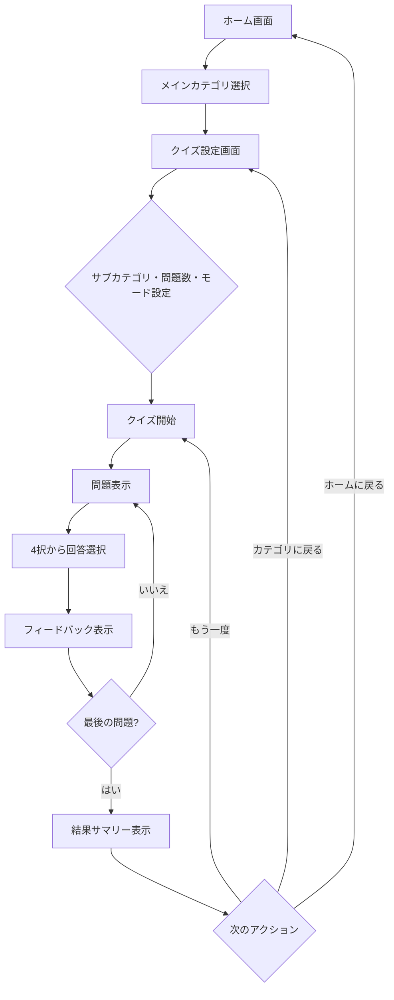

# Word Drill 機能仕様書

> **バージョン**: 1.0
> **作成日**: 2026-02-27
> **ステータス**: 下書き

## 概要

英単語・プログラミング英語・IT用語を4択クイズ形式で学習できるWebアプリケーション。
GitHub Pagesでホスティングし、学習履歴はIndexedDBでローカル保存する。

## 背景

プログラマやIT系の学習者にとって、英単語・プログラミング用語・IT用語の知識は必須だが、
効率的に反復学習できるツールが不足している。特に、プログラミング言語固有の用語（Rustのownership、JavaScriptのhoistingなど）を体系的に学べる仕組みが求められている。

Word Drillは、カテゴリ別に整理された4択クイズを通じて、これらの用語を効率的に習得するための学習アプリケーションである。

## 技術スタック

| カテゴリ | 技術 |
|:---------|:-----|
| フレームワーク | React 19 + TypeScript |
| ルーティング | TanStack Router（ファイルベースルーティング） |
| ビルドツール | Vite（rolldown-vite） |
| スタイリング | SCSS Modules |
| テスト | Vitest + Testing Library + Playwright |
| コンポーネントカタログ | Storybook |
| データ永続化 | IndexedDB（計画中） |
| ホスティング | GitHub Pages + GitHub Actions（計画中） |
| パッケージマネージャ | pnpm |

## スコープ

**対象範囲**:
- カテゴリ一覧表示（ホーム画面）
- クイズ設定（サブカテゴリ・問題数・モード・シャッフル選択）
- クイズ実行（4択問題・フィードバック・結果表示・回答履歴一覧）
- 学習統計の表示（計画中）
- テーマ切り替え（11テーマ）
- クイズデータのJSON形式管理
- IndexedDBによる学習履歴の永続化（計画中）

**対象外**:
- ユーザー認証・アカウント管理
- サーバーサイド処理
- 問題の追加・編集UI（将来の拡張候補）
- JSONインポート/エクスポート（将来の拡張候補）
- PWA対応（将来の拡張候補）
- スペースドリピティション（将来の拡張候補）

## ユーザーストーリー

| ID | ～として | ～したい | ～のために | 優先度 |
|:---|:---------|:---------|:-----------|:-------|
| US-001 | 学習者 | カテゴリ一覧から学習したい分野を選びたい | 効率的に目的の問題セットにアクセスするため | 高 |
| US-002 | 学習者 | サブカテゴリ・問題数・出題モードを設定したい | 学習目的やレベルに合った出題を受けるため | 高 |
| US-003 | 学習者 | 4択クイズで用語を学習したい | 反復練習で語彙力を向上させるため | 高 |
| US-004 | 学習者 | 回答直後に正解・不正解のフィードバックを得たい | 即座に正しい知識を定着させるため | 高 |
| US-005 | 学習者 | クイズ終了後に結果サマリーを確認したい | 学習の達成度を把握するため | 高 |
| US-006 | 学習者 | 学習統計を確認したい | 自分の進捗や苦手分野を把握するため | 中 |
| US-007 | 学習者 | アプリのテーマカラーを変更したい | 好みの見た目で快適に学習するため | 低 |
| US-008 | 学習者 | 前回の学習結果が保存されていてほしい | 継続的な進捗管理ができるため | 中 |

## 処理フロー

## ルーティング

| ルート | ページ | 説明 |
|:-------|:-------|:-----|
| `/` | ホーム | メインカテゴリ一覧 |
| `/category/:categoryId` | クイズ設定 | サブカテゴリ・問題数・モード選択 |
| `/quiz/:category/play` | クイズ実行 | 問題表示・回答・結果 |
| `/stats` | 学習統計 | 統計ダッシュボード（計画中） |

## 仕様書一覧

| 仕様書 | 説明 |
|:-------|:-----|
| [home-spec.md](./home-spec.md) | [FE] ホーム画面 - カテゴリ一覧・ナビゲーション |
| [quiz-settings-spec.md](./quiz-settings-spec.md) | [FE] クイズ設定画面 - サブカテゴリ・問題数・モード選択 |
| [quiz-play-spec.md](./quiz-play-spec.md) | [FE] クイズ実行画面 - 問題表示・回答・フィードバック・結果 |
| [stats-spec.md](./stats-spec.md) | [FE] 統計画面 - 全体統計・カテゴリ別・苦手単語（計画中） |
| [theme-spec.md](./theme-spec.md) | [FE] テーマシステム - テーマ切り替え・カラースキーム |
| [quiz-data-spec.md](./quiz-data-spec.md) | クイズデータ - ファイル形式・パーサー・バリデーション・カテゴリ体系 |
| [data-persistence-spec.md](./data-persistence-spec.md) | [DB] データ永続化 - IndexedDBスキーマ・回答履歴・統計（計画中） |

## 非機能要件

| カテゴリ | 要件 | 目標値 |
|:---------|:-----|:-------|
| パフォーマンス | 初回表示 (LCP) | 2.5秒以内 |
| パフォーマンス | 操作応答 (INP) | 200ms以内 |
| パフォーマンス | バンドルサイズ | 200KB以下 (gzip) |
| レスポンシブ | モバイル対応 | 320px〜対応 |
| アクセシビリティ | WCAG準拠レベル | AA |
| ブラウザ対応 | 対象ブラウザ | Chrome, Firefox, Safari, Edge 最新2バージョン |
| データ | オフライン対応 | IndexedDBによるローカル永続化 |

## エラーハンドリング方針

アプリ全体で統一的に適用するエラーハンドリングのポリシー。

### 原則

1. **ユーザー体験を最優先**: エラーが発生してもクイズの進行やナビゲーションを可能な限り妨げない
2. **サイレントに失敗しない**: エラーが発生したことはユーザーに通知する（ただし重大度に応じて通知方法を変える）
3. **リカバリ手段を提供**: エラー表示時には必ず次のアクション（リトライ、ホームに戻る等）を提示する

### エラーカテゴリと対応方針

| カテゴリ | 発生条件 | ユーザーへの影響 | 対応方法 |
|:---------|:---------|:---------------|:---------|
| データ読み込みエラー | クイズファイルの fetch 失敗 / JSON パースエラー | クイズ開始不可 | エラーメッセージ表示 + カテゴリ設定に戻るリンク |
| バリデーションエラー | クイズファイルのフォーマット不正 | クイズ開始不可 | エラー詳細表示（ValidationError の path + message） |
| IndexedDB エラー | DB 接続失敗 / 書き込み失敗 | 履歴保存不可（クイズは続行可） | コンソールにログ出力。統計画面ではエラーメッセージ表示 |
| ルーティングエラー | 無効なカテゴリID / 存在しないルート | ページ表示不可 | ホーム画面にリダイレクト |
| 状態不整合 | フェーズガード違反（例: playing 以外で回答選択） | なし（操作が無視される） | アクションを無視。コンソールに警告ログ |

### エラー表示パターン

| パターン | 用途 | UI |
|:---------|:-----|:---|
| ページレベルエラー | データ読み込み失敗など、画面全体が表示不可 | エラーアイコン + メッセージ + アクションボタン（リトライ/ホームに戻る） |
| インラインエラー | フォームバリデーションエラー | フィールド下部に赤文字でエラーメッセージ |
| サイレントエラー | IndexedDB 書き込み失敗など、ユーザー操作に影響しないエラー | コンソールにログ出力のみ。クイズは正常に続行 |

### IndexedDB エラー時のフォールバック

IndexedDB が利用できない環境（プライベートブラウジングの一部等）では:

- **クイズ機能**: 正常に動作する（状態はメモリ上で管理）
- **統計画面**: 「統計機能を利用するにはブラウザの設定でストレージを有効にしてください」と表示
- **回答履歴**: 保存されない旨を初回起動時にトースト通知

## 用語集

| 用語 | 定義 |
|:-----|:-----|
| メインカテゴリ | 最上位のカテゴリ区分（英単語、プログラミング英語、IT用語） |
| サブカテゴリ | メインカテゴリ内の細分化された分野（例: Rust, TOEIC） |
| クイズモード | 出題形式。term-to-meaning（用語→意味）、meaning-to-term（意味→用語）、random（ランダム） |
| 問題数 | 1回のクイズで出題する問題の数（10, 20, または全部） |
| フィードバック | 回答直後に表示される正解/不正解の結果表示 |
| 結果サマリー | クイズ終了後に表示される正答数・正答率の一覧 |
| テーマ | アプリの配色・フォントを定義するカラースキームのプリセット |
| クイズファイル | JSON形式のクイズ問題データファイル |
| Companion Object | 型定義と同名のオブジェクトでファクトリ関数やユーティリティを提供するパターン |

## 変更履歴

| バージョン | 日付 | 変更内容 | 変更者 |
|:-----------|:-----|:---------|:-------|
| 1.0 | 2026-02-27 | 初版作成 | - |
| 1.1 | 2026-02-28 | シャッフル設定、離脱防止、回答履歴表示、データ読み込み方式、期間フィルタ、エラーハンドリング方針を追加 | - |
