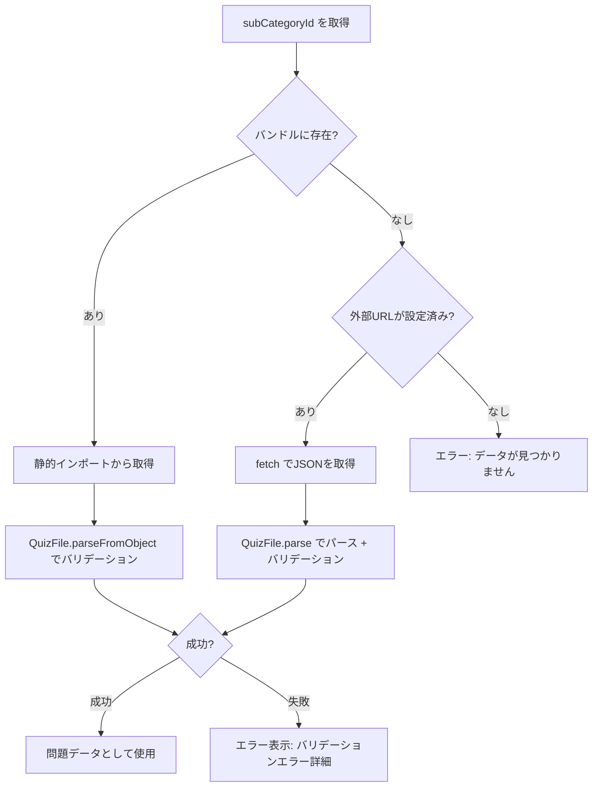

# Word Drill - クイズデータ仕様

> **機能**: [Word Drill](./index.md)
> **ステータス**: 下書き

## 概要

クイズ問題データのファイル形式、パーサー、バリデーション、およびカテゴリ体系を定義する。
クイズデータはJSON形式で管理され、将来的には外部URL（Gist等）からの配信にも対応する。

## カテゴリ体系

### メインカテゴリ

| ID | 名前 | アイコン | 説明 |
|:---|:-----|:--------|:-----|
| `english` | 英単語 | 📖 | 日常英語からテクニカルライティングまで |
| `programming` | プログラミング英語 | 💻 | プログラミングで使う英単語 |
| `it` | IT用語 | 🖥️ | ITの基礎概念と専門用語 |

### サブカテゴリ

#### 英単語

| ID | 名前 | アイコン | 説明 |
|:---|:-----|:--------|:-----|
| `en-general` | 一般 | 📝 | 日常・ビジネス英語 |
| `en-toeic` | TOEIC | 📊 | TOEIC頻出単語 |
| `en-technical-docs` | 技術文書 | 📄 | 論文・ドキュメント頻出表現 |

#### プログラミング英語

| ID | 名前 | アイコン | 説明 |
|:---|:-----|:--------|:-----|
| `prog-common` | 共通 | 🔧 | 言語問わず使う英単語 |
| `prog-rust` | Rust | 🦀 | ownership, borrowing, lifetime など |
| `prog-javascript` | JavaScript | 🟨 | hoisting, closure, prototype など |
| `prog-go` | Go | 🐹 | goroutine, defer, channel など |

#### IT用語

| ID | 名前 | アイコン | 説明 |
|:---|:-----|:--------|:-----|
| `it-programming` | プログラミング概念 | 💡 | OOP, デザインパターン, アルゴリズム |
| `it-infra` | インフラ | ☁️ | クラウド, コンテナ, ネットワーク |
| `it-security` | セキュリティ | 🔒 | 脆弱性, 認証, 暗号化 |
| `it-database` | データベース | 🗄️ | SQL, NoSQL, トランザクション |

### 型定義

```typescript
type SubCategory = {
  id: string          // サブカテゴリID（例: "en-toeic"）
  name: string        // 表示名（例: "TOEIC"）
  description: string // 説明文
  icon: string        // 絵文字アイコン
  wordCount: number   // 登録単語数
}

type MainCategory = {
  id: string              // メインカテゴリID（例: "english"）
  name: string            // 表示名
  description: string     // 説明文
  icon: string            // 絵文字アイコン
  subCategories: SubCategory[]
}
```

## クイズファイル形式

### バージョン管理

**バージョニング方式**: semver形式 (`MAJOR.MINOR.PATCH`)

| バージョン | 意味 |
|:----------|:-----|
| MAJOR | 後方互換性のない変更（フィールド削除・型変更） |
| MINOR | 後方互換性のある機能追加（オプショナルフィールド追加） |
| PATCH | データ修正 |

**現在のバージョン**: `1.0.0`

### ファイル構造

```json
{
  "version": "1.0.0",
  "metadata": {
    "category": "prog-rust",
    "name": "Rust",
    "description": "ownership, borrowing, lifetime など",
    "createdAt": "2026-02-01",
    "updatedAt": "2026-02-01"
  },
  "questions": [
    {
      "id": "prog-rust-001",
      "term": "ownership",
      "meaning": "Rustにおけるメモリ管理の基本概念。各値は所有者を持ち、所有者がスコープを抜けると値は解放される。",
      "choices": [
        "所有権",
        "借用",
        "ライフタイム",
        "参照"
      ],
      "answer": 0,
      "example": "let s1 = String::from(\"hello\"); let s2 = s1; // s1 の ownership が s2 に移動"
    }
  ]
}
```

### フィールド定義

#### ルートオブジェクト (QuizFile)

| フィールド | 型 | 必須 | 説明 |
|:----------|:---|:-----|:-----|
| version | string | はい | ファイル形式のバージョン (semver) |
| metadata | QuizFileMetadata | はい | ファイルのメタ情報 |
| questions | QuizQuestion[] | はい | 問題リスト（1問以上） |

```typescript
type QuizFile = {
  version: string
  metadata: QuizFileMetadata
  questions: QuizQuestion[]
}
```

#### メタデータ (QuizFileMetadata)

| フィールド | 型 | 必須 | 説明 | 例 |
|:----------|:---|:-----|:-----|:---|
| category | string | はい | サブカテゴリID | `prog-rust` |
| name | string | はい | カテゴリ表示名 | `Rust` |
| description | string | はい | カテゴリの説明 | `ownership, borrowing...` |
| createdAt | string | はい | 作成日 (YYYY-MM-DD) | `2026-02-01` |
| updatedAt | string | はい | 更新日 (YYYY-MM-DD) | `2026-02-01` |

```typescript
type QuizFileMetadata = {
  category: string
  name: string
  description: string
  createdAt: string
  updatedAt: string
}
```

#### 問題 (QuizQuestion)

| フィールド | 型 | 必須 | 説明 | 例 |
|:----------|:---|:-----|:-----|:---|
| id | string | はい | 一意のID | `prog-rust-001` |
| term | string | はい | 用語・単語 | `ownership` |
| meaning | string | はい | 意味・説明 | `Rustにおけるメモリ管理の...` |
| choices | `[string, string, string, string]` | はい | 4択の選択肢（4つ固定） | `["所有権", "借用", ...]` |
| answer | `0 \| 1 \| 2 \| 3` | はい | 正解のインデックス | `0` |
| example | string | いいえ | 例文 | `let s1 = String::from(...)` |

```typescript
type QuizQuestion = {
  id: string
  term: string
  meaning: string
  choices: [string, string, string, string]
  answer: 0 | 1 | 2 | 3
  example?: string
}
```

#### 問題IDの命名規則

```
{サブカテゴリID}-{3桁連番}
```

例: `prog-rust-001`, `en-toeic-042`, `it-security-015`

## パーサーとバリデーション

### パーサーAPI

```typescript
// JSON文字列からパース
QuizFile.parse(json: string): ParseResult<QuizFile>

// オブジェクトからパース（バリデーションのみ）
QuizFile.parseFromObject(data: unknown): ParseResult<QuizFile>

// バリデーションのみ（エラー配列を返す）
QuizFile.validate(data: unknown): ValidationError[]
```

### ParseResult 型

```typescript
type ParseResult<T> =
  | { success: true; data: T }
  | { success: false; errors: ValidationError[] }

const ParseResult = {
  ok: <T>(data: T): ParseResult<T> => ({ success: true, data }),
  err: <T>(errors: ValidationError[]): ParseResult<T> => ({ success: false, errors })
}
```

### ValidationError 型

```typescript
type ValidationError = {
  path: string      // エラー箇所のパス（例: "questions[0].choices"）
  message: string   // エラーメッセージ
}

const ValidationError = {
  create: (path: string, message: string): ValidationError => ({ path, message })
}
```

### バリデーションルール

| ルール | 対象 | エラーメッセージ |
|:-------|:-----|:---------------|
| semver形式 | `version` | `version は有効なsemver形式で指定してください` |
| 必須文字列 | `metadata.category`, `metadata.name`, `metadata.description`, `metadata.createdAt`, `metadata.updatedAt` | `{path} は文字列で指定してください` |
| 配列・1問以上 | `questions` | `questions は1つ以上の問題を含む配列で指定してください` |
| 必須文字列 | `questions[].id`, `questions[].term`, `questions[].meaning` | `{path} は文字列で指定してください` |
| 4要素の文字列配列 | `questions[].choices` | `{path} は4つの文字列を含む配列で指定してください` |
| 0〜3の数値 | `questions[].answer` | `{path} は0〜3の数値で指定してください` |
| ID一意性 | `questions[].id` | `問題ID "{id}" が重複しています` |

### semverバリデーション

正規表現: `/^\d+\.\d+\.\d+$/`

有効例: `1.0.0`, `2.1.3`
無効例: `1.0`, `v1.0.0`, `1.0.0-beta`

## データ読み込み方式

クイズデータの読み込みは2つの方式をサポートする。

### 方式1: バンドル同梱（デフォルト）

クイズファイル（JSON）をビルド時に静的にインポートしてバンドルに含める。

```typescript
// 例: static import
import rustQuiz from '../data/prog-rust.json'
```

**配置場所**: `src/data/quiz/` ディレクトリ配下にサブカテゴリIDと同名のJSONファイルを配置。

```
src/data/quiz/
├── en-general.json
├── en-toeic.json
├── en-technical-docs.json
├── prog-common.json
├── prog-rust.json
├── prog-javascript.json
├── prog-go.json
├── it-programming.json
├── it-infra.json
├── it-security.json
└── it-database.json
```

**メリット**: オフラインでも動作。ビルド時にバリデーション可能。
**デメリット**: データ更新にはビルド・デプロイが必要。

### 方式2: 外部URL読み込み（将来対応）

`fetch` で外部URLからJSONを取得し、`QuizFile.parse()` でバリデーション後に使用する。

**想定する配信元**:
- GitHub Gist (Raw URL)
- 任意のホスティングサービス

**外部配信時の要件**:

| 項目 | 要件 |
|:-----|:-----|
| Content-Type | `application/json` |
| 文字エンコーディング | UTF-8 |
| CORS | `Access-Control-Allow-Origin` ヘッダーが必要 |

### 読み込みフロー



## 制限事項

- 現在、クイズファイルの外部読み込みは未実装（モックデータを使用）
- semverのプレリリースタグ（例: `1.0.0-beta`）は非対応
- 各サブカテゴリの `wordCount` は現在すべて 0（クイズデータ未作成）
- カテゴリ体系は静的にコード内に定義されており、動的な追加は不可

## 変更履歴

| バージョン | 日付 | 変更内容 |
|:----------|:-----|:---------|
| 1.0.0 | 2026-02-01 | 初版 |

## 関連仕様

- [quiz-settings-spec.md](./quiz-settings-spec.md) - サブカテゴリ選択で使用するカテゴリデータ
- [quiz-play-spec.md](./quiz-play-spec.md) - QuizQuestion を使ったクイズ実行
- [data-persistence-spec.md](./data-persistence-spec.md) - 問題IDによる統計データの紐付け
