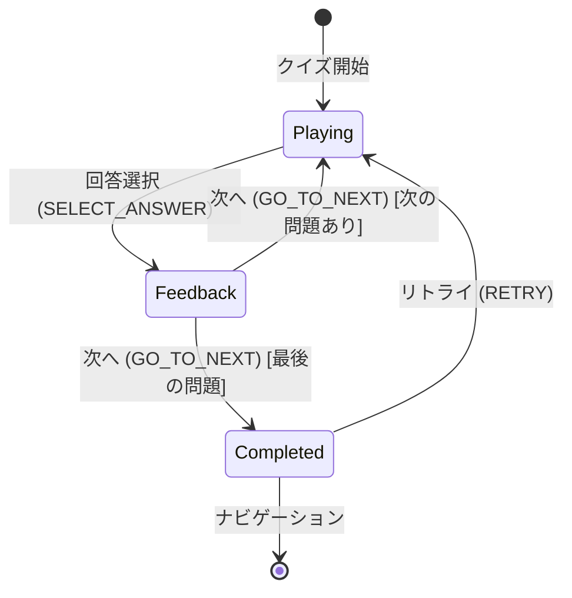
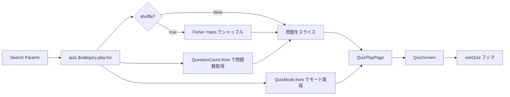

# Word Drill - クイズ実行画面仕様（フロントエンド）

> **機能**: [Word Drill](./index.md)
> **ステータス**: 下書き

## 概要

4択クイズの実行画面。問題表示、回答選択、正解/不正解のフィードバック、最終結果サマリーの表示までを担うコア機能。

## ページ構成

| ページ | URL | 説明 |
|:-------|:----|:-----|
| クイズ実行 | `/quiz/:category/play` | 問題表示・回答・結果 |

## ルートパラメータとクエリパラメータ

### パスパラメータ

| パラメータ | 型 | 説明 | 例 |
|:----------|:---|:-----|:---|
| `category` | string | メインカテゴリID | `english` |

### Search Params

| パラメータ | 型 | 必須 | デフォルト | 説明 |
|:----------|:---|:-----|:----------|:-----|
| `subCategoryId` | string | いいえ | - | サブカテゴリID |
| `questionCount` | `10 \| 20 \| 'all'` | いいえ | `10` | 出題問題数 |
| `quizMode` | `QuizMode` | いいえ | `'term-to-meaning'` | 出題モード |
| `shuffle` | `'true' \| 'false'` | いいえ | `'true'` | 出題順のシャッフル |

`QuestionCount.from()` と `QuizMode.from()` で検証・デフォルト値の適用を行う。

## レイアウト

### Playing フェーズ

```
┌─────────────────────────────────────────┐
│ Header (共通)                            │
├─────────────────────────────────────────┤
│                                         │
│  カテゴリ名                               │
│  進捗 ████████░░░░░░ 3 / 10             │
│                                         │
│  ┌─────────────────────────────────┐    │
│  │ 用語                            │    │
│  │                                 │    │
│  │ ownership                       │    │
│  │                                 │    │
│  │ let s1 = String::from("hello"); │    │
│  │ let s2 = s1;                    │    │
│  └─────────────────────────────────┘    │
│                                         │
│  ┌─────────────────────────────────┐    │
│  │ A  所有権                        │    │
│  ├─────────────────────────────────┤    │
│  │ B  借用                          │    │
│  ├─────────────────────────────────┤    │
│  │ C  ライフタイム                   │    │
│  ├─────────────────────────────────┤    │
│  │ D  参照                          │    │
│  └─────────────────────────────────┘    │
│                                         │
└─────────────────────────────────────────┘
```

### Feedback フェーズ

```
┌─────────────────────────────────────────┐
│  （Playing と同じ構成 + 結果表示）         │
│                                         │
│  選択肢に色が付く:                        │
│  │ A  所有権            [正解 ✓]  │      │
│  │ B  借用              [選択 ✗]  │      │
│                                         │
│  ┌─────────────────────────────────┐    │
│  │ ✗ 不正解...                     │    │
│  │                                 │    │
│  │ 正解: 所有権                     │    │
│  │ 意味: Rustにおけるメモリ管理の... │    │
│  │                                 │    │
│  │         [次へ →]                │    │
│  └─────────────────────────────────┘    │
│                                         │
└─────────────────────────────────────────┘
```

### Completed フェーズ

```
┌─────────────────────────────────────────┐
│                                         │
│  ┌─────────────────────────────────┐    │
│  │                                 │    │
│  │        🎉 素晴らしい！           │    │
│  │                                 │    │
│  │          正答率 80%              │    │
│  │          8 / 10                 │    │
│  │                                 │    │
│  │     [もう一度]                   │    │
│  │     [カテゴリに戻る]              │    │
│  │     [ホームに戻る]               │    │
│  │                                 │    │
│  │  ── 回答履歴 ──────────────────  │    │
│  │                                 │    │
│  │  1. ownership          ✓ 正解   │    │
│  │  2. borrowing          ✗ 不正解  │    │
│  │     正解: 借用                   │    │
│  │  3. lifetime           ✓ 正解   │    │
│  │  ...                            │    │
│  │                                 │    │
│  └─────────────────────────────────┘    │
│                                         │
└─────────────────────────────────────────┘
```

## コンポーネント

| コンポーネント | 種別 | 説明 | Props |
|:-------------|:-----|:-----|:------|
| QuizPlayPage | ページ | クイズ画面全体のコンテナ | `categoryId`, `categoryName`, `questions`, `mode` |
| QuizScreen | コンテナ | フェーズに応じた描画切り替え | `questions`, `categoryName`, `mode`, `onBackToCategory`, `onBackToHome` |
| QuizProgressHeader | ヘッダー | 進捗表示 | `current`, `total`, `categoryName?` |
| QuizCard | カード | 問題文の表示 | `term`, `meaning`, `example?`, `mode` |
| QuizChoices | ボタン群 | 4択の選択肢 | `choices`, `selectedIndex`, `correctIndex?`, `onSelect`, `disabled?`, `showResult?` |
| QuizResultFeedback | カード | 回答後のフィードバック | `isCorrect`, `correctAnswer`, `selectedAnswer`, `meaning`, `onNext` |
| QuizResultSummary | カード | 最終結果表示 | `result`, `questions`, `onRetry`, `onBackToCategory`, `onBackToHome` |
| AnswerHistoryList | リスト | 回答履歴一覧 | `answers`, `questions` |

## 状態管理

### クイズ状態マシン



### QuizState 型

```typescript
type QuizPhase = 'playing' | 'feedback' | 'completed'

type QuizState = {
  phase: QuizPhase
  currentIndex: number
  answers: AnswerRecord[]
}
```

### 初期状態

```typescript
QuizState.create() → {
  phase: 'playing',
  currentIndex: 0,
  answers: []
}
```

### アクション

| アクション | ペイロード | 前提条件 | 状態遷移 |
|:----------|:---------|:---------|:---------|
| `SELECT_ANSWER` | `questionId`, `selectedIndex`, `correctIndex` | `phase === 'playing'` | `playing` → `feedback`。`AnswerRecord` を `answers` に追加 |
| `GO_TO_NEXT` | `questionsLength` | `phase === 'feedback'` | 次の問題あり → `feedback` → `playing` (`currentIndex + 1`)。最後の問題 → `feedback` → `completed` |
| `RETRY` | なし | `phase === 'completed'` | `completed` → `playing`（初期状態にリセット） |

### AnswerRecord 型

```typescript
type AnswerRecord = {
  questionId: string
  selectedIndex: number
  correctIndex: number
  isCorrect: boolean     // selectedIndex === correctIndex
}
```

**ファクトリ関数** (`AnswerRecord.create`):
- `selectedIndex === correctIndex` のとき `isCorrect: true`

### QuizResult 型

```typescript
type QuizResult = {
  correctCount: number   // isCorrect === true の数
  totalCount: number     // answers.length
  answers: AnswerRecord[]
}
```

**ファクトリ関数** (`QuizResult.create`):
- `answers` 配列から正答数と総数を計算

**正答率計算** (`QuizResult.getAccuracyRate`):
- `Math.round((correctCount / totalCount) * 100)`

### useQuiz フック

```typescript
type UseQuizReturn = {
  state: QuizState
  currentQuestion: QuizQuestion | null
  selectAnswer: (index: number) => void
  goToNext: () => void
  retry: () => void
  result: QuizResult | null    // completed フェーズでのみ値を持つ
}
```

## ユーザー操作

| 操作 | トリガー | 振る舞い | フェーズ |
|:-----|:--------|:---------|:--------|
| 回答選択 | 選択肢ボタンをクリック | `SELECT_ANSWER` を発行。正解/不正解を即座にフィードバック表示 | Playing |
| 次の問題へ | 「次へ →」ボタンをクリック | `GO_TO_NEXT` を発行。次の問題を表示 or 結果サマリーへ | Feedback |
| もう一度 | 「もう一度」ボタンをクリック | `RETRY` を発行。同じ問題セットで最初から | Completed |
| カテゴリに戻る | 「カテゴリに戻る」ボタンをクリック | カテゴリ設定画面に遷移 | Completed |
| ホームに戻る | 「ホームに戻る」ボタンをクリック | ホーム画面に遷移 | Completed |

## コンポーネント詳細

### QuizCard

問題カードの表示ロジック:

| モード | 表示ラベル | 表示内容 | 例文表示 |
|:-------|:---------|:---------|:---------|
| `term-to-meaning` | 「用語」 | `question.term` | `question.example` があれば表示 |
| `meaning-to-term` | 「意味」 | `question.meaning` | 表示しない |

`random` モードの場合は `QuizMode.resolve()` で `term-to-meaning` または `meaning-to-term` のいずれかに解決される（50%の確率）。解決はクイズ開始時に1回だけ行われる。

### QuizChoices

選択肢ボタンの表示:

| 状態 | ボタンバリアント | インデックスラベル |
|:-----|:--------------|:----------------|
| 未選択（Playing） | `secondary` | A / B / C / D |
| 選択中（Feedback・正解） | `primary` | A / B / C / D |
| 選択中（Feedback・不正解） | `tertiary` | A / B / C / D |
| 正解の選択肢（Feedback） | `primary` | A / B / C / D |

Feedback フェーズでは全ボタンが `disabled` になる。

### QuizResultFeedback

| 表示要素 | 正解時 | 不正解時 |
|:---------|:-------|:--------|
| アイコン | ✓ | ✗ |
| ステータス | 「正解！」 | 「不正解...」 |
| 正解表示 | 表示なし | 「正解: {correctAnswer}」 |
| 意味表示 | `question.meaning` | `question.meaning` |
| アクション | 「次へ →」ボタン | 「次へ →」ボタン |

### QuizResultSummary

正答率に応じた表示:

| 正答率 | アイコン | メッセージ |
|:-------|:--------|:---------|
| 80%以上 | 🎉 | 「素晴らしい！」 |
| 60%〜79% | 👍 | 「よくできました！」 |
| 60%未満 | 💪 | 「もう少し頑張ろう！」 |

表示項目:
- 正答率（パーセント表示）
- スコア（`{correctCount} / {totalCount}`）
- アクションボタン3つ
- 回答履歴一覧（AnswerHistoryList）

### AnswerHistoryList

結果サマリーの下部に、各問題の回答結果を一覧表示する。

| 表示要素 | ソース | フォーマット |
|:---------|:-------|:------------|
| 問題番号 | `index + 1` | `{N}.` |
| 用語 | `questions[index].term` | テキスト |
| 正誤アイコン | `answer.isCorrect` | ✓（正解） / ✗（不正解） |
| 正解表示 | 不正解の場合のみ | 「正解: {choices[correctIndex]}」 |

不正解の問題はハイライト表示（背景色を `error` 系の淡い色に）し、視覚的に目立たせる。

## 問題データの流れ



### シャッフルアルゴリズム

`shuffle=true` の場合、問題配列を Fisher-Yates アルゴリズムでランダムに並び替えてから `questionCount` に基づいてスライスする。
シャッフルは `questionCount` によるスライスの前に行う（全問題からランダムに選出される）。

### データ読み込み方式

問題データの読み込みは2段階で対応する:

1. **バンドル同梱（デフォルト）**: クイズファイル（JSON）を `import` で静的にバンドルに含める
2. **外部URL読み込み（将来対応）**: `fetch` で外部URLからJSONを取得し、`QuizFile.parse()` でバリデーション後に使用

**現在の制限**: モックデータを使用中。バンドル同梱の実装が最初のステップ。

## 離脱防止

クイズ実行中（`phase !== 'completed'` かつ `answers.length > 0`）にページを離れようとした場合、ブラウザの確認ダイアログを表示する。

| トリガー | 対応方法 |
|:--------|:---------|
| ブラウザバック / 閉じる / リロード | `beforeunload` イベントで確認ダイアログを表示 |
| アプリ内ナビゲーション（ヘッダーリンク等） | TanStack Router の `beforeLeave` ガードで `window.confirm('クイズを中断しますか？進捗は保存されません。')` を表示 |

**対象外**: Completed フェーズでは離脱防止を無効化する（結果表示後は自由にナビゲーション可能）。

## エラー表示

| エラーケース | 発生条件 | 表示方法 |
|:------------|:---------|:---------|
| 問題データなし | questions 配列が空 | クイズ開始不可（設定画面で防止） |
| 無効なカテゴリ | パスパラメータが不正 | ホーム画面にリダイレクト |
| データ読み込み失敗 | fetch エラーまたはバリデーションエラー | エラーメッセージ表示 + カテゴリに戻るリンク |

## レスポンシブ対応

| ブレークポイント | レイアウト変更 |
|:---------------|:-------------|
| モバイル（〜767px） | 問題カード・選択肢を全幅表示。フォントサイズ縮小。選択肢ボタンのパディング拡大（タッチターゲット確保） |
| タブレット（768〜1023px） | 問題カードの最大幅を制限。選択肢ボタンのサイズは変更なし |
| デスクトップ（1024px〜） | コンテンツエリアの最大幅を制限。中央寄せレイアウト |

## アクセシビリティ

| 観点 | 対応方針 |
|:-----|:---------|
| キーボード操作 | Tab で選択肢ボタン間を移動、Enter/Space で回答選択。Feedback フェーズでは「次へ」にフォーカス移動 |
| スクリーンリーダー | 問題文を `aria-label` で通知。回答後に正解/不正解を `aria-live="assertive"` で通知 |
| カラーコントラスト | 正解（緑系）/不正解（赤系）の色分けに加え、アイコン（✓/✗）でも判別可能にする |
| フォーカス管理 | 新しい問題表示時にQuizCardにフォーカス。Feedback表示時に「次へ」にフォーカス。結果表示時に結果カードにフォーカス |
| 進捗通知 | ProgressBar に `role="progressbar"`, `aria-valuenow`, `aria-valuemin`, `aria-valuemax` を設定 |
| タッチターゲット | 選択肢ボタンは最低 44x44px のタッチ領域を確保 |

## パフォーマンス

| 指標 | 目標値 | 対策 |
|:-----|:-------|:-----|
| 操作応答 (INP) | 100ms以内 | useReducer による同期的な状態更新 |
| 問題切り替え | 即座 | クライアントサイドの状態遷移のみ。API呼び出しなし |
| 結果計算 | 即座 | QuizResult.create による O(n) の計算 |

## 制限事項

- randomモードの解決はクイズ開始時に1回のみ（問題ごとの切り替えではない）
- 回答の取り消し・やり直しは不可（一度選択したら確定）
- クイズ途中でブラウザを閉じた場合、進捗は保存されない（確認ダイアログで警告はする）
- シャッフルのシード値は保持しない（リトライ時は再シャッフルされる）

## 関連仕様

- [quiz-settings-spec.md](./quiz-settings-spec.md) - 設定画面からの遷移元。search params の生成元
- [quiz-data-spec.md](./quiz-data-spec.md) - QuizQuestion の型定義。問題データの構造
- [data-persistence-spec.md](./data-persistence-spec.md) - 回答履歴の保存先（計画中）
