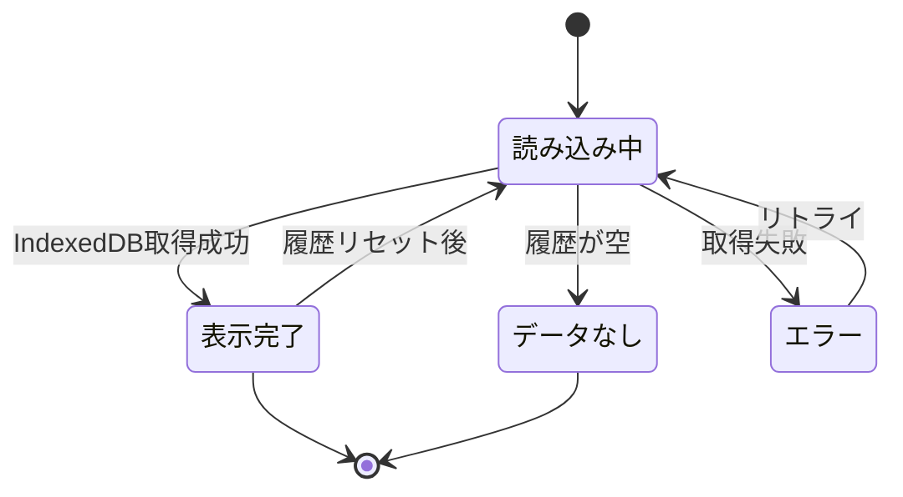

# Word Drill - 統計画面仕様（フロントエンド）

> **機能**: [Word Drill](./index.md)
> **ステータス**: 計画中

## 概要

学習の進捗状況を可視化する統計ダッシュボード。全体の正答率、カテゴリ別の成績、苦手な単語の一覧を表示する。
IndexedDBに保存された回答履歴データを集計して表示する。

## ページ構成

| ページ | URL | 説明 |
|:-------|:----|:-----|
| 学習統計 | `/stats` | 統計ダッシュボード |

## レイアウト

```
┌─────────────────────────────────────────┐
│ Header (共通)                            │
├─────────────────────────────────────────┤
│                                         │
│  📊 学習統計                              │
│                                         │
│  期間: [今週] [今月] [全期間]              │
│                                         │
│  ┌──────────────────────────────────┐   │
│  │ 全体統計                          │   │
│  │ ┌─────────┬─────────┬─────────┐  │   │
│  │ │ 総回答数 │ 正答率   │ 連続学習 │  │   │
│  │ │   150   │  72%    │  5日    │  │   │
│  │ └─────────┴─────────┴─────────┘  │   │
│  └──────────────────────────────────┘   │
│                                         │
│  ┌──────────────────────────────────┐   │
│  │ カテゴリ別                        │   │
│  │                                  │   │
│  │ ▶ 英単語 ██████████░░░ 78%      │   │
│  │                                  │   │
│  │ ▼ プログラミング英語 ████░░░ 65% │   │
│  │   ├ 共通         ██████░░ 70%   │   │
│  │   ├ Rust         ████░░░░ 55%   │   │
│  │   └ JavaScript   █████░░░ 68%   │   │
│  │                                  │   │
│  │ ▶ IT用語 ███████░░░░ 71%        │   │
│  └──────────────────────────────────┘   │
│                                         │
│  ┌──────────────────────────────────┐   │
│  │ 苦手な単語                        │   │
│  │                                  │   │
│  │ ownership    正答率: 40% (2/5)   │   │
│  │ borrowing    正答率: 33% (1/3)   │   │
│  │ hoisting     正答率: 50% (2/4)   │   │
│  └──────────────────────────────────┘   │
│                                         │
│  [📤 履歴リセット]                       │
│                                         │
└─────────────────────────────────────────┘
```

## コンポーネント

| コンポーネント | 種別 | 説明 | 振る舞い |
|:-------------|:-----|:-----|:---------|
| StatsPage | ページ | 統計画面全体のコンテナ | フィルタ + 3つのセクションを描画 |
| PeriodFilter | ボタングループ | 期間フィルタ | 今週/今月/全期間の切り替え |
| OverallStats | カード | 全体統計の表示 | 総回答数、全体正答率、連続学習日数を表示 |
| CategoryStats | アコーディオン | カテゴリ別正答率 | メインカテゴリをクリックで展開/折りたたみ |
| CategoryProgressBar | バー | カテゴリの正答率バー | 正答率に応じたバーを表示 |
| WeakWordsList | リスト | 苦手な単語一覧 | 正答率50%以下の単語をリスト表示 |
| ResetButton | ボタン | 履歴リセット | 確認ダイアログ後に全履歴を削除 |

## 期間フィルタ

統計データの表示対象期間を切り替えるフィルタ。全セクション（全体統計、カテゴリ別、苦手な単語）に横断的に適用される。

### フィルタ選択肢

| ラベル | 値 | 説明 |
|:-------|:---|:-----|
| 今週 | `this-week` | 今週の月曜日 00:00:00 から現在まで |
| 今月 | `this-month` | 今月の1日 00:00:00 から現在まで |
| 全期間 | `all` | 全履歴（デフォルト） |

### フィルタの適用方法

`history` ストアの `timestamp` インデックスを使い、指定期間内のレコードのみを集計対象とする。

- **全体統計**: フィルタ期間内の回答数・正答率を表示。連続学習日数は常に全期間で計算。
- **カテゴリ別**: フィルタ期間内の回答に基づいて正答率を計算。
- **苦手な単語**: フィルタ期間内の回答に基づいて正答率を計算。期間内に回答がない単語は表示しない。

### UI

ボタングループ（トグルボタン）形式。選択中のボタンは `primary` バリアント、非選択は `secondary` バリアント。

## 表示データ

### 全体統計

| フィールド | ソース | フォーマット | 空の場合 |
|:----------|:-------|:------------|:---------|
| 総回答数 | `history` ストアの全レコード数 | 数値 | `0` |
| 全体正答率 | `history` ストアの `correct === true` の割合 | パーセント | `--` |
| 学習日数 | `history.timestamp` からユニーク日付を計算 | `{N}日` | `0日` |
| 連続学習日数 | 直近の連続する日付を計算 | `{N}日` | `0日` |

### カテゴリ別統計

| フィールド | ソース | フォーマット | 空の場合 |
|:----------|:-------|:------------|:---------|
| メインカテゴリ正答率 | 配下の全サブカテゴリの集計 | パーセント + ProgressBar | `--` |
| サブカテゴリ正答率 | `history` ストアの `category` でフィルタ | パーセント + ProgressBar | `--` |

### 苦手な単語

| フィールド | ソース | フォーマット | 空の場合 |
|:----------|:-------|:------------|:---------|
| 単語名 | `stats` ストアの `questionId` → 問題データから `term` を取得 | テキスト | - |
| 正答率 | `stats.correctCount / (correctCount + wrongCount)` | パーセント | - |
| 回答回数 | `stats.correctCount + stats.wrongCount` | `{正答数}/{総回答数}` | - |

**フィルタ条件**: 正答率 50% 以下、かつ回答回数 2 回以上

## ユーザー操作

| 操作 | トリガー | 振る舞い | 遷移先 |
|:-----|:--------|:---------|:-------|
| 期間切り替え | PeriodFilter のボタンをクリック | 選択した期間で統計を再集計して表示を更新 | - |
| カテゴリ展開 | メインカテゴリ行をクリック | アコーディオンを展開し、サブカテゴリ別の正答率を表示 | - |
| カテゴリ折りたたみ | 展開中のメインカテゴリ行をクリック | アコーディオンを折りたたむ | - |
| 履歴リセット | 「履歴リセット」ボタンをクリック | 確認ダイアログを表示。確認後に全履歴を削除 | - |
| ホームへ戻る | ヘッダーのロゴをクリック | ホーム画面に遷移 | `/` |

## 状態管理

### ページの状態

| 状態名 | 型 | 初期値 | 更新トリガー |
|:-------|:---|:-------|:-----------|
| period | `'this-week' \| 'this-month' \| 'all'` | `'all'` | PeriodFilter の切り替え |
| overallStats | `OverallStats` | ローディング中 | IndexedDB からのデータ読み込み完了、または期間切り替え |
| categoryStats | `CategoryStats[]` | ローディング中 | IndexedDB からのデータ読み込み完了、または期間切り替え |
| weakWords | `WeakWord[]` | ローディング中 | IndexedDB からのデータ読み込み完了、または期間切り替え |
| expandedCategories | `Set<string>` | 空 | アコーディオンの展開/折りたたみ |

### 状態遷移図



## エラー表示

| エラーケース | 発生条件 | 表示方法 | ユーザーアクション |
|:------------|:---------|:---------|:----------------|
| データ未取得 | IndexedDB 未初期化 or エラー | エラーメッセージ表示 | リトライボタン |
| 学習履歴なし | 回答履歴が0件 | 「まだ学習履歴がありません。クイズを始めてみましょう！」 | ホームへのリンク表示 |
| リセット確認 | リセットボタン押下 | 確認ダイアログ「本当に学習履歴をリセットしますか？この操作は取り消せません。」 | OK/キャンセル |

## レスポンシブ対応

| ブレークポイント | レイアウト変更 |
|:---------------|:-------------|
| モバイル（〜767px） | 全体統計のカードを縦並び（1列）に変更。ProgressBarの幅を縮小。苦手単語リストのフォントサイズ縮小 |
| タブレット（768〜1023px） | 全体統計のカードを横並び（3列）。カテゴリ別・苦手単語は全幅 |
| デスクトップ（1024px〜） | 最大幅制限あり。全体統計は3列カード。十分な余白 |

## アクセシビリティ

| 観点 | 対応方針 |
|:-----|:---------|
| キーボード操作 | Tab でセクション間を移動。Enter/Space でアコーディオンの展開/折りたたみ |
| スクリーンリーダー | 全体統計の各数値に `aria-label`（例: 「総回答数 150」）。アコーディオンに `aria-expanded` 属性。ProgressBar に `role="progressbar"` + `aria-valuenow` |
| カラーコントラスト | ProgressBar の塗り色と背景色のコントラスト比 3:1 以上。テキストは 4.5:1 以上 |
| フォーカス管理 | ページ遷移時にページタイトルにフォーカス。リセット確認ダイアログはフォーカストラップ |
| ライブリージョン | 履歴リセット完了時に `aria-live="polite"` で「履歴をリセットしました」と通知 |

## パフォーマンス

| 指標 | 目標値 | 対策 |
|:-----|:-------|:-----|
| 初回表示 (LCP) | 1秒以内 | IndexedDB からの非同期読み込み + ローディング表示 |
| カテゴリ展開 | 100ms以内 | 展開データはメモリ上にキャッシュ済み |
| 履歴リセット | 500ms以内 | IndexedDB のクリア操作 |

## 制限事項

- 現在はスタブのみ実装（「Statistics Page」テキスト表示のみ）
- IndexedDB のデータ永続化が実装されるまで本画面は機能しない
- 苦手単語の表示には問題データ（QuizFile）の読み込みが必要
- 大量の履歴データ（10,000件以上）がある場合のパフォーマンスは未検証

## 関連仕様

- [data-persistence-spec.md](./data-persistence-spec.md) - 統計データのソースとなるIndexedDBスキーマ
- [quiz-play-spec.md](./quiz-play-spec.md) - 回答履歴の生成元
- [quiz-data-spec.md](./quiz-data-spec.md) - 苦手単語の表示に必要な問題データ
