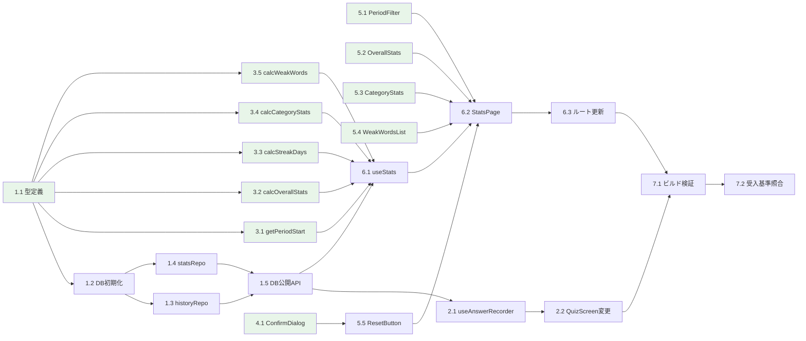

# 学習統計画面 + データ永続化 - タスクリスト

> **参照仕様書**: `docs/impl-detail-stats.md`

## タスク一覧

### Phase 1: DB 基盤層

| # | タスク | blockedBy | 並列 | 完了基準 | 状態 |
|:--|:-------|:----------|:-----|:---------|:-----|
| 1.1 | DB 型定義（types.ts） | — | [P] | HistoryRecord, StatsRecord 型が定義されている | [x] |
| 1.2 | DB 初期化・接続管理（database.ts） | 1.1 | | getDB でシングルトン接続、history/stats ストア・インデックス作成。テスト含む | [x] |
| 1.3 | history リポジトリ（historyRepository.ts） | 1.2 | [P] | addHistory, getAllHistory, clearHistory が動作。テスト含む | [x] |
| 1.4 | stats リポジトリ（statsRepository.ts） | 1.2 | [P] | upsertStats, clearStats が動作。テスト含む | [x] |
| 1.5 | DB 公開 API（index.ts: recordAnswer, clearAllData） | 1.3, 1.4 | | recordAnswer が1トランザクションで history+stats を更新。clearAllData が両ストアをクリア。テスト含む | [x] |

### Phase 2: クイズ連携（回答書き込み）

| # | タスク | blockedBy | 並列 | 完了基準 | 状態 |
|:--|:-------|:----------|:-----|:---------|:-----|
| 2.1 | useAnswerRecorder フック作成 | 1.5 | | answers 変化を検知して DB 書き込み。retry 後の重複書き込み防止。テスト含む（fake-indexeddb） | [x] |
| 2.2 | QuizScreen に categoryId props 追加・useAnswerRecorder 呼び出し | 2.1 | | QuizScreen が categoryId を受け取り useAnswerRecorder を呼び出す。既存テストが壊れていない | [x] |

### Phase 3: 統計集計ロジック（純粋関数）

| # | タスク | blockedBy | 並列 | 完了基準 | 状態 |
|:--|:-------|:----------|:-----|:---------|:-----|
| 3.1 | statsCalculator: getPeriodStart | 1.1 | [P] | this-week（月曜00:00）、this-month（1日00:00）、all（0）を正しく返す。テスト含む | [ ] |
| 3.2 | statsCalculator: calcOverallStats | 1.1 | [P] | 総回答数・正答率・学習日数を計算。回答0件で null。テスト含む | [ ] |
| 3.3 | statsCalculator: calcStreakDays | 1.1 | [P] | 今日起点の連続学習日数。今日未学習なら0。テスト含む | [ ] |
| 3.4 | statsCalculator: calcCategoryStats | 1.1 | [P] | メイン/サブカテゴリ別集計。未知カテゴリは「その他」。テスト含む | [ ] |
| 3.5 | statsCalculator: calcWeakWords | 1.1 | [P] | 正答率50%以下+回答2回以上を抽出、正答率昇順ソート。テスト含む | [ ] |

### Phase 4: 共通コンポーネント

| # | タスク | blockedBy | 並列 | 完了基準 | 状態 |
|:--|:-------|:----------|:-----|:---------|:-----|
| 4.1 | ConfirmDialog コンポーネント | — | [P] | open/close、ESCで閉じる、フォーカストラップ、aria属性。テスト含む | [ ] |

### Phase 5: 統計画面 UI コンポーネント

| # | タスク | blockedBy | 並列 | 完了基準 | 状態 |
|:--|:-------|:----------|:-----|:---------|:-----|
| 5.1 | PeriodFilter コンポーネント | — | [P] | 今週/今月/全期間ボタン、選択状態の primary バリアント。テスト含む | [ ] |
| 5.2 | OverallStats コンポーネント | — | [P] | 総回答数・正答率・学習日数・連続学習日数のカード表示。正答率 null で `--`。テスト含む | [ ] |
| 5.3 | CategoryStats コンポーネント | — | [P] | メインカテゴリ/サブカテゴリのアコーディオン、ProgressBar使用、aria-expanded。テスト含む | [ ] |
| 5.4 | WeakWordsList コンポーネント | — | [P] | questionId と正答率のリスト表示。0件時メッセージ。テスト含む | [ ] |
| 5.5 | ResetButton コンポーネント | 4.1 | | ConfirmDialog 使用、aria-live で完了通知。テスト含む | [ ] |

### Phase 6: 統計画面 統合

| # | タスク | blockedBy | 並列 | 完了基準 | 状態 |
|:--|:-------|:----------|:-----|:---------|:-----|
| 6.1 | useStats フック | 1.5, 3.1, 3.2, 3.3, 3.4, 3.5 | | useReducer で loading/loaded/empty/error 管理。期間切り替えでメモリ上再計算。resetHistory。テスト含む（fake-indexeddb） | [x] |
| 6.2 | StatsPage コンテナ | 5.1, 5.2, 5.3, 5.4, 5.5, 6.1 | | 全サブコンポーネント統合、レスポンシブ3ブレークポイント。テスト含む（fake-indexeddb） | [x] |
| 6.3 | ルート更新（stats.tsx） | 6.2 | | スタブ → StatsPage 描画 | [x] |

### Phase 7: 最終検証

| # | タスク | blockedBy | 並列 | 完了基準 | 状態 |
|:--|:-------|:----------|:-----|:---------|:-----|
| 7.1 | ビルド・リント・型チェック | 6.3, 2.2 | | `pnpm build` / `pnpm lint` / `pnpm test` 全て exit code 0 | [x] |
| 7.2 | 受入基準の照合 | 7.1 | | impl-detail-stats.md セクション11 の受入基準 #1〜#13 を全て満たす | [ ] |

<!-- [P] = 他タスクと並列実行可能 -->
<!-- blockedBy: そのタスクの開始前に完了が必要なタスク番号。依存なしは「—」 -->

## 依存関係図

## タスク詳細

### タスク 1.1: DB 型定義

**概要**: IndexedDB の HistoryRecord, StatsRecord 型を定義する

**対象ファイル**:
- `src/lib/db/types.ts` - 新規作成

**blockedBy**: なし

**完了基準**:
- [x] HistoryRecord 型が定義されている（id?, questionId, category, correct, timestamp）
- [x] StatsRecord 型が定義されている（questionId, correctCount, wrongCount, lastAnswered）
- [x] 型が export されている

**注意事項**:
- `id` は `autoIncrement` のため optional（`id?: number`）

---

### タスク 1.2: DB 初期化・接続管理

**概要**: IndexedDB の接続をシングルトンで管理し、history/stats ストアとインデックスを作成する

**対象ファイル**:
- `src/lib/db/database.ts` - 新規作成
- `src/lib/db/database.test.ts` - 新規作成

**blockedBy**: 1.1

**完了基準**:
- [x] `getDB()` がシングルトンで `WordDrillDB` を返す
- [x] `upgrade` で history ストア（autoIncrement, questionId/category/timestamp インデックス）を作成
- [x] `upgrade` で stats ストア（keyPath: questionId）を作成
- [x] テスト: DB 初期化で history/stats ストアが存在する（T-001）

**注意事項**:
- `idb` ライブラリを使用（`openDB`）
- テストでは `fake-indexeddb` を使用
- `WordDrillDBSchema` の interface 定義もこのファイルに含む

---

### タスク 1.3: history リポジトリ

**概要**: history ストアの CRUD 操作を実装する

**対象ファイル**:
- `src/lib/db/historyRepository.ts` - 新規作成
- `src/lib/db/historyRepository.test.ts` - 新規作成

**blockedBy**: 1.2

**完了基準**:
- [x] `addHistory(db, record)` で履歴1件追加、ID を返す
- [x] `getAllHistory(db)` で全件取得
- [x] `clearHistory(db)` で全件削除
- [x] テスト: T-002, T-003, T-004 が pass

**注意事項**:
- `db` は引数として受け取る（シングルトンの `getDB()` は呼び出し側で解決）

---

### タスク 1.4: stats リポジトリ

**概要**: stats ストアの get/upsert/clear 操作を実装する

**対象ファイル**:
- `src/lib/db/statsRepository.ts` - 新規作成
- `src/lib/db/statsRepository.test.ts` - 新規作成

**blockedBy**: 1.2

**完了基準**:
- [x] `upsertStats(db, questionId, correct)` で新規作成/既存更新
- [x] `clearStats(db)` で全件削除
- [x] テスト: T-005, T-006 が pass

**注意事項**:
- upsert: レコードがなければ新規作成、あれば correctCount/wrongCount をインクリメント

---

### タスク 1.5: DB 公開 API（recordAnswer, clearAllData）

**概要**: history 追加 + stats 更新を1トランザクションで行う `recordAnswer` と、両ストアを一括クリアする `clearAllData` を実装する

**対象ファイル**:
- `src/lib/db/index.ts` - 新規作成（re-export + recordAnswer + clearAllData）
- `src/lib/db/index.test.ts` - 新規作成（T-007, T-008 のテスト追加先。または既存テストファイルに統合）

**blockedBy**: 1.3, 1.4

**完了基準**:
- [x] `recordAnswer` が1トランザクション内で history 追加 + stats 更新
- [x] `clearAllData` が1トランザクション内で history + stats をクリア
- [x] re-export: types, getDB, リポジトリ関数群
- [x] テスト: T-007, T-008 が pass

**注意事項**:
- `db.transaction(['history', 'stats'], 'readwrite')` で複数ストアをまたぐトランザクション

---

### タスク 2.1: useAnswerRecorder フック

**概要**: answers 配列の変化を検知し、新しい回答を IndexedDB に書き込むフック

**対象ファイル**:
- `src/features/quiz/hooks/useAnswerRecorder.ts` - 新規作成
- `src/features/quiz/hooks/useAnswerRecorder.test.ts` - 新規作成

**blockedBy**: 1.5

**完了基準**:
- [x] `useEffect` + `useRef(recorded)` で新しい回答のみ検知 ※useCallback ベースのシンプルな実装で対応
- [x] `getDB()` → `recordAnswer()` を fire-and-forget で呼び出し
- [x] エラーは `console.error` のみ（クイズ進行をブロックしない）
- [ ] テスト: T-030, T-031 が pass ※未作成

**注意事項**:
- `recorded.current` を `answers.length` ではなく、書き込み開始前に更新して重複防止
- retry で answers がリセット（空配列に）されたケースでの `recorded.current` リセットも考慮

---

### タスク 2.2: QuizScreen に categoryId props 追加

**概要**: QuizScreen に `categoryId` props を追加し、`useAnswerRecorder` を呼び出す

**対象ファイル**:
- `src/features/quiz/components/QuizScreen/QuizScreen.tsx` - 変更

**blockedBy**: 2.1

**完了基準**:
- [x] `QuizScreenProps` に `categoryId: string` を追加
- [x] `useAnswerRecorder(categoryId, state.answers)` を呼び出す
- [x] QuizScreen の呼び出し元で `categoryId` を渡すように修正
- [x] 既存テストが壊れていない

**注意事項**:
- `useQuiz` のシグネチャは変更禁止（セクション1.3）
- 呼び出し元のルートファイル等で `categoryId` の取得方法を確認すること

---

### タスク 3.1: statsCalculator - getPeriodStart

**概要**: 期間フィルタの開始タイムスタンプを返す純粋関数

**対象ファイル**:
- `src/features/stats/utils/statsCalculator.ts` - 新規作成（このタスクでは getPeriodStart + Period 型のみ）
- `src/features/stats/utils/statsCalculator.test.ts` - 新規作成

**blockedBy**: 1.1（HistoryRecord 型を import）

**完了基準**:
- [ ] `'this-week'` → 今週月曜 00:00:00 のタイムスタンプ
- [ ] `'this-month'` → 今月1日 00:00:00 のタイムスタンプ
- [ ] `'all'` → 0
- [ ] テスト: T-020, T-021, T-022 が pass

**注意事項**:
- ローカルタイムゾーンで計算
- `Period` 型もこのファイルに定義

---

### タスク 3.2: statsCalculator - calcOverallStats

**概要**: 回答履歴から全体統計を計算する純粋関数

**対象ファイル**:
- `src/features/stats/utils/statsCalculator.ts` - 追記
- `src/features/stats/utils/statsCalculator.test.ts` - 追記

**blockedBy**: 1.1

**完了基準**:
- [ ] 総回答数・正答率（Math.round）・学習日数を計算
- [ ] 回答0件で `accuracyRate: null`
- [ ] `allRecords` から連続学習日数を算出（`calcStreakDays` を内部利用）
- [ ] テスト: T-010, T-011 が pass

**注意事項**:
- `calcStreakDays`（3.3）に依存するが、同一ファイル内なので並列着手可能

---

### タスク 3.3: statsCalculator - calcStreakDays

**概要**: 今日起点の連続学習日数を計算する純粋関数

**対象ファイル**:
- `src/features/stats/utils/statsCalculator.ts` - 追記
- `src/features/stats/utils/statsCalculator.test.ts` - 追記

**blockedBy**: 1.1

**完了基準**:
- [ ] 今日含む連続日数を返す
- [ ] 今日未学習なら 0
- [ ] 1日空きがあると途切れる
- [ ] テスト: T-012, T-013, T-014 が pass

**注意事項**:
- ローカルタイムゾーンで日付判定

---

### タスク 3.4: statsCalculator - calcCategoryStats

**概要**: カテゴリ別統計を計算する純粋関数

**対象ファイル**:
- `src/features/stats/utils/statsCalculator.ts` - 追記
- `src/features/stats/utils/statsCalculator.test.ts` - 追記

**blockedBy**: 1.1

**完了基準**:
- [ ] サブカテゴリ → メインカテゴリの逆引きマップを `categories.ts` から構築
- [ ] メインカテゴリの正答率は配下全回答から計算
- [ ] 未知カテゴリID は「その他」にまとめる
- [ ] テスト: T-015, T-016 が pass

**注意事項**:
- `mainCategories` を `src/features/category/data/categories.ts` から import

---

### タスク 3.5: statsCalculator - calcWeakWords

**概要**: 苦手な単語を抽出する純粋関数

**対象ファイル**:
- `src/features/stats/utils/statsCalculator.ts` - 追記
- `src/features/stats/utils/statsCalculator.test.ts` - 追記

**blockedBy**: 1.1

**完了基準**:
- [ ] 正答率50%以下 かつ 回答2回以上の問題を抽出
- [ ] 正答率の低い順にソート
- [ ] 回答1回のみの問題は除外
- [ ] テスト: T-017, T-018, T-019 が pass

---

### タスク 4.1: ConfirmDialog コンポーネント

**概要**: 汎用確認ダイアログモーダル。フォーカストラップ、ESC で閉じる、aria 属性対応

**対象ファイル**:
- `src/components/ConfirmDialog/index.ts` - 新規作成
- `src/components/ConfirmDialog/ConfirmDialog.tsx` - 新規作成
- `src/components/ConfirmDialog/ConfirmDialog.scss` - 新規作成
- `src/components/ConfirmDialog/ConfirmDialog.test.tsx` - 新規作成

**blockedBy**: なし

**完了基準**:
- [ ] `ConfirmDialogProps` 通りの props を受け取る
- [ ] `open=true` でダイアログ表示、`open=false` で非表示
- [ ] ESC キーで `onCancel` が呼ばれる
- [ ] Tab キーでフォーカスがダイアログ内でループ
- [ ] `role="dialog"`, `aria-modal="true"`, `aria-labelledby` 設定
- [ ] テスト: T-090, T-091, T-092 が pass

**注意事項**:
- `confirmLabel` デフォルト "OK"、`cancelLabel` デフォルト "キャンセル"

---

### タスク 5.1: PeriodFilter コンポーネント

**概要**: 今週/今月/全期間の期間フィルタボタングループ

**対象ファイル**:
- `src/features/stats/components/PeriodFilter/index.ts` - 新規作成
- `src/features/stats/components/PeriodFilter/PeriodFilter.tsx` - 新規作成
- `src/features/stats/components/PeriodFilter/PeriodFilter.scss` - 新規作成
- `src/features/stats/components/PeriodFilter/PeriodFilter.test.tsx` - 新規作成

**blockedBy**: なし

**完了基準**:
- [ ] 「今週」「今月」「全期間」3つのボタンを表示
- [ ] 選択中のボタンに primary バリアント適用
- [ ] クリックで `onPeriodChange` コールバック発火
- [ ] テスト: T-040, T-041 が pass

---

### タスク 5.2: OverallStats コンポーネント

**概要**: 全体統計（総回答数・正答率・学習日数・連続学習日数）のカード表示

**対象ファイル**:
- `src/features/stats/components/OverallStats/index.ts` - 新規作成
- `src/features/stats/components/OverallStats/OverallStats.tsx` - 新規作成
- `src/features/stats/components/OverallStats/OverallStats.scss` - 新規作成
- `src/features/stats/components/OverallStats/OverallStats.test.tsx` - 新規作成

**blockedBy**: なし

**完了基準**:
- [ ] `OverallStatsData` を props で受け取り表示
- [ ] 正答率 null のとき `--` と表示
- [ ] テスト: T-050, T-051 が pass

---

### タスク 5.3: CategoryStats コンポーネント

**概要**: メインカテゴリ/サブカテゴリ別の正答率アコーディオン

**対象ファイル**:
- `src/features/stats/components/CategoryStats/index.ts` - 新規作成
- `src/features/stats/components/CategoryStats/CategoryStats.tsx` - 新規作成
- `src/features/stats/components/CategoryStats/CategoryStats.scss` - 新規作成
- `src/features/stats/components/CategoryStats/CategoryStats.test.tsx` - 新規作成

**blockedBy**: なし

**完了基準**:
- [ ] メインカテゴリ行クリックでサブカテゴリが展開/折りたたみ
- [ ] ProgressBar で正答率を視覚表示
- [ ] `aria-expanded` が展開状態に連動
- [ ] テスト: T-060, T-061, T-062 が pass

**注意事項**:
- 既存の `ProgressBar` コンポーネントを使用

---

### タスク 5.4: WeakWordsList コンポーネント

**概要**: 苦手な単語（questionId + 正答率）のリスト表示

**対象ファイル**:
- `src/features/stats/components/WeakWordsList/index.ts` - 新規作成
- `src/features/stats/components/WeakWordsList/WeakWordsList.tsx` - 新規作成
- `src/features/stats/components/WeakWordsList/WeakWordsList.scss` - 新規作成
- `src/features/stats/components/WeakWordsList/WeakWordsList.test.tsx` - 新規作成

**blockedBy**: なし

**完了基準**:
- [ ] `WeakWordData[]` を props で受け取り、questionId と正答率を表示
- [ ] 0件の場合「苦手な単語はありません」メッセージ
- [ ] テスト: T-070, T-071 が pass

---

### タスク 5.5: ResetButton コンポーネント

**概要**: ConfirmDialog を使用した履歴リセットボタン

**対象ファイル**:
- `src/features/stats/components/ResetButton/index.ts` - 新規作成
- `src/features/stats/components/ResetButton/ResetButton.tsx` - 新規作成
- `src/features/stats/components/ResetButton/ResetButton.scss` - 新規作成
- `src/features/stats/components/ResetButton/ResetButton.test.tsx` - 新規作成

**blockedBy**: 4.1

**完了基準**:
- [ ] クリックで ConfirmDialog を表示
- [ ] キャンセルで何もしない
- [ ] OK で `onReset` コールバック発火
- [ ] リセット完了時に `aria-live` で通知
- [ ] テスト: T-080, T-081 が pass

---

### タスク 6.1: useStats フック

**概要**: 統計データの取得・集計・状態管理を行う useReducer ベースのフック

**対象ファイル**:
- `src/features/stats/hooks/useStats.ts` - 新規作成
- `src/features/stats/hooks/useStats.test.ts` - 新規作成

**blockedBy**: 1.5, 3.1, 3.2, 3.3, 3.4, 3.5

**完了基準**:
- [ ] `useReducer` で `loading → loaded/empty/error` の状態遷移
- [ ] マウント時に `getDB()` → `getAllHistory()` → 各 calc 関数で集計
- [ ] `setPeriod` でメモリ上の全履歴から再計算（DB 再アクセスなし）
- [ ] `toggleCategory` でアコーディオン展開状態管理（`Set<string>`）
- [ ] `resetHistory` で `clearAllData` → `LOAD_EMPTY` へ遷移
- [ ] テスト: fake-indexeddb にデータ投入後の状態遷移を検証

---

### タスク 6.2: StatsPage コンテナ

**概要**: 全サブコンポーネントを統合する統計画面コンテナ

**対象ファイル**:
- `src/features/stats/index.ts` - 新規作成（re-export）
- `src/features/stats/components/StatsPage/index.ts` - 新規作成
- `src/features/stats/components/StatsPage/StatsPage.tsx` - 新規作成
- `src/features/stats/components/StatsPage/StatsPage.scss` - 新規作成
- `src/features/stats/components/StatsPage/StatsPage.test.tsx` - 新規作成

**blockedBy**: 5.1, 5.2, 5.3, 5.4, 5.5, 6.1

**完了基準**:
- [ ] `useStats` でデータ取得し、各サブコンポーネントに props を渡す
- [ ] `status: 'loading'` → ローディング表示
- [ ] `status: 'empty'` → 空状態メッセージ + ホームリンク
- [ ] `status: 'error'` → エラーメッセージ + リトライボタン
- [ ] `status: 'loaded'` → PeriodFilter + OverallStats + CategoryStats + WeakWordsList + ResetButton
- [ ] レスポンシブ: モバイル（〜767px）/ タブレット（768〜1023px）/ デスクトップ（1024px〜）
- [ ] テスト: T-100, T-101 が pass

---

### タスク 6.3: ルート更新

**概要**: `/stats` ルートのスタブを StatsPage に置き換える

**対象ファイル**:
- `src/app/routes/stats.tsx` - 変更

**blockedBy**: 6.2

**完了基準**:
- [x] `/stats` にアクセスで StatsPage が描画される

---

### タスク 7.1: ビルド・リント・型チェック

**概要**: 全体のビルド検証

**対象ファイル**: なし（コマンド実行のみ）

**blockedBy**: 6.3, 2.2

**完了基準**:
- [x] `pnpm build` が exit code 0（D-1, D-4）
- [x] `pnpm test` が全テスト pass（D-2）
- [x] `pnpm lint` が警告・エラー 0件（D-3）

---

### タスク 7.2: 受入基準の照合

**概要**: 実装仕様書の受入基準を全て満たすことを確認

**対象ファイル**: なし（確認のみ）

**blockedBy**: 7.1

**完了基準**:
- [ ] 受入基準 #1〜#13 を全て満たす（D-5）
- [ ] エッジケースが全て処理されている（D-6）
- [ ] エラーハンドリングが定義通り（D-7）
- [ ] useQuiz のシグネチャが変更されていない（D-13）
