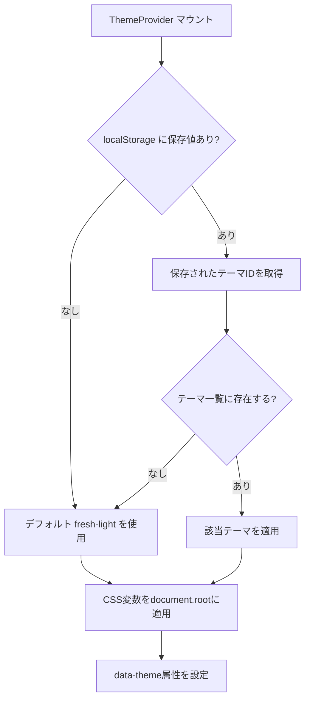

# Word Drill - テーマシステム仕様（フロントエンド）

> **機能**: [Word Drill](./index.md)
> **ステータス**: 下書き

## 概要

アプリ全体の配色とタイポグラフィを切り替えるテーマシステム。11種類のプリセットテーマを提供し、ユーザーの選択をlocalStorageに永続化する。

## コンポーネント

| コンポーネント | 種別 | 説明 | 振る舞い |
|:-------------|:-----|:-----|:---------|
| ThemeProvider | Context Provider | テーマ状態の管理と配信 | CSS変数の適用、localStorageとの同期 |
| ThemeSwitcher | セレクトボックス | テーマ選択UI | ドロップダウンでテーマ一覧を表示、選択時にテーマ切り替え |

## テーマ構造

### Theme 型

```typescript
type Theme = {
  id: string
  name: string
  description: string
  colorScheme: 'light' | 'dark'
  colors: ColorPalette
  typography: Typography
}
```

### ColorPalette 型

```typescript
type ColorPalette = {
  primary: string        // メインカラー
  primaryLight: string   // メインカラー（明るい）
  primaryGlow: string    // メインカラーの光彩
  secondary: string      // セカンダリカラー
  secondaryGlow: string  // セカンダリの光彩
  accent: string         // アクセントカラー
  success: string        // 正解・成功
  error: string          // 不正解・エラー
  bgPrimary: string      // 背景色（メイン）
  bgSecondary: string    // 背景色（サブ）
  bgGlass: string        // ガラスモーフィズム背景
  cardBg: string         // カード背景
  border: string         // ボーダー
  borderHover: string    // ボーダー（ホバー時）
  textPrimary: string    // テキスト（メイン）
  textSecondary: string  // テキスト（サブ）
  textLight: string      // テキスト（薄い）
}
```

### Typography 型

```typescript
type Typography = {
  fontDisplay: string    // 見出しフォント
  fontBody: string       // 本文フォント
  fontEmoji: string      // 絵文字フォント
}
```

### デフォルトタイポグラフィ

```typescript
{
  fontDisplay: "'Orbitron', sans-serif",
  fontBody: "'Noto Sans JP', 'Hiragino Sans', 'Hiragino Kaku Gothic ProN', 'メイリオ', Meiryo, sans-serif",
  fontEmoji: "'Noto Color Emoji', 'Apple Color Emoji', 'Segoe UI Emoji', sans-serif"
}
```

## テーマ一覧

| ID | 名前 | カラースキーム | 説明 |
|:---|:-----|:-------------|:-----|
| `fresh-light` | Fresh Light | light | デフォルトテーマ。青紫系の明るいトーン |
| `ocean-depths` | Ocean Depths | dark | 海をイメージしたティール系ダークテーマ |
| `tech-innovation` | Tech Innovation | dark | ネオンシアン・ブルー系のテックテーマ |
| `midnight-galaxy` | Midnight Galaxy | dark | 深い紫の銀河テーマ |
| `forest-canopy` | Forest Canopy | light | 緑とアースカラーの森林テーマ |
| `sunset-boulevard` | Sunset Boulevard | dark | 暖かいオレンジ・レッド系の夕焼けテーマ |
| `arctic-frost` | Arctic Frost | light | クールなシアン・ブルー系の氷テーマ |
| `desert-rose` | Desert Rose | light | ダスティローズ・モーブ系テーマ |
| `botanical-garden` | Botanical Garden | light | ガーデングリーンのボタニカルテーマ |
| `golden-hour` | Golden Hour | light | ウォームアンバー・オレンジのゴールデンテーマ |
| `modern-minimalist` | Modern Minimalist | light | グレースケールのミニマリストテーマ |

## 状態管理

### ThemeContext

```typescript
type ThemeContextType = {
  theme: Theme              // 現在のテーマオブジェクト
  currentThemeId: string    // 現在のテーマID
  setTheme: (themeId: string) => void  // テーマ変更関数
  availableThemes: Theme[]  // 全テーマの配列
}
```

### 永続化

| キー | ストレージ | 値 | デフォルト |
|:-----|:---------|:---|:---------|
| `word-drill-theme-id` | localStorage | テーマID文字列 | `fresh-light` |

### 初期化フロー



## CSS変数の適用

ThemeProviderが `document.documentElement.style` に以下のCSS変数を設定する:

### カラー変数

ColorPalette の各キーを `--color-{camelCaseKey}` 形式でCSS変数に変換する。

| CSS変数 | 対応するプロパティ |
|:--------|:----------------|
| `--color-primary` | `colors.primary` |
| `--color-primaryLight` | `colors.primaryLight` |
| `--color-primaryGlow` | `colors.primaryGlow` |
| `--color-secondary` | `colors.secondary` |
| `--color-secondaryGlow` | `colors.secondaryGlow` |
| `--color-accent` | `colors.accent` |
| `--color-success` | `colors.success` |
| `--color-error` | `colors.error` |
| `--color-bgPrimary` | `colors.bgPrimary` |
| `--color-bgSecondary` | `colors.bgSecondary` |
| `--color-bgGlass` | `colors.bgGlass` |
| `--color-cardBg` | `colors.cardBg` |
| `--color-border` | `colors.border` |
| `--color-borderHover` | `colors.borderHover` |
| `--color-textPrimary` | `colors.textPrimary` |
| `--color-textSecondary` | `colors.textSecondary` |
| `--color-textLight` | `colors.textLight` |

### タイポグラフィ変数

| CSS変数 | 対応するプロパティ |
|:--------|:----------------|
| `--font-display` | `typography.fontDisplay` |
| `--font-body` | `typography.fontBody` |
| `--font-emoji` | `typography.fontEmoji` |

### data-theme 属性

`document.documentElement` に `data-theme="{themeId}"` 属性を設定。
テーマ固有のスタイルを CSS セレクタ `[data-theme="ocean-depths"]` で適用できる。

## ユーザー操作

| 操作 | トリガー | 振る舞い |
|:-----|:--------|:---------|
| テーマ変更 | ThemeSwitcher のドロップダウンからテーマを選択 | `setTheme(themeId)` → CSS変数更新 → localStorage 保存 → 即座に画面に反映 |

## ThemeSwitcher の表示

| 表示要素 | ソース | フォーマット |
|:---------|:-------|:------------|
| テーマ名一覧 | `availableThemes` | Select コンポーネントのオプション (`{ label: theme.name, value: theme.id }`) |
| 選択中のテーマ | `currentThemeId` | Select の選択状態 |

## useTheme フック

```typescript
const { theme, currentThemeId, setTheme, availableThemes } = useTheme()
```

ThemeContext へのアクセスを提供するカスタムフック。コンテキスト外での使用時はエラーをスローする。

## レスポンシブ対応

| ブレークポイント | レイアウト変更 |
|:---------------|:-------------|
| モバイル（〜767px） | ThemeSwitcher のセレクトボックスがフル幅に近い幅で表示 |
| タブレット以上（768px〜） | ThemeSwitcher はヘッダー内にコンパクトに配置 |

## アクセシビリティ

| 観点 | 対応方針 |
|:-----|:---------|
| キーボード操作 | Select コンポーネントは標準の `<select>` 要素のキーボード操作に準拠 |
| スクリーンリーダー | Select に `aria-label="テーマ選択"` を設定。テーマ変更時に `aria-live="polite"` で「テーマを{テーマ名}に変更しました」と通知 |
| カラーコントラスト | 全テーマで WCAG AA のコントラスト比を確保（テキスト/背景: 4.5:1 以上、大きいテキスト/UI: 3:1 以上） |
| 色覚特性 | success/error の色分けには色以外の手がかり（アイコン、テキスト）も併用 |
| prefers-color-scheme | 将来的にOSのダークモード設定に連動するオプションを検討 |

## 制限事項

- テーマのカスタマイズ（ユーザー定義テーマ）は非対応
- 全テーマのコントラスト比が WCAG AA を満たすことは未検証
- テーマ変更時のアニメーション/トランジションは未実装
- フォント（Orbitron, Noto Sans JP）は外部CDNからの読み込みが必要

## 関連仕様

- [home-spec.md](./home-spec.md) - ヘッダー内のThemeSwitcher配置
- [quiz-play-spec.md](./quiz-play-spec.md) - テーマのsuccess/errorカラーがクイズフィードバックに影響
